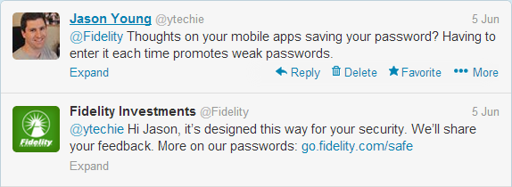
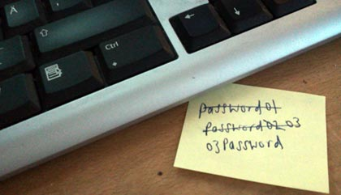

Just when password security began to improve, mobile computing became ubiquitous and redefined the problem we thought we had solved. This post is long overdue, and I would like to explore the issues facing passwords and security today. I'm certainly not a security expert, but I believe these are issues that face everyone.

Mobile passwords are terrible, but first we need to talk about how we got here.

###Poor Passwords on the Desktop

First, let's examine where we came from. Passwords on the desktop were terrible in the early days of computing. People would often use the name of one of their children, name of their dog, an object in the room, or whatever happened to pop into their mind. Thankfully, the rise of the Internet and the fear of hackers and security caused most to reevaluate their passwords. A number or an extra word made everyone feel better about their password.

When you log on to your computer, it generates a result known as a hash using a one-way formula and compares the results to the data stored in a file called the "SAM" file. This allows the computer to verify your password without actually storing it. It's a simple and elegant solution.

In the early 2000's, I was setting up PC computer images, and found myself in a situation where I needed to recover the administrator password on a Windows machine. I downloaded a brute force password cracking tool, and let it get to work on the SAM file from the computer. The first step for these programs is to hash every word in the dictionary and compare these to the values in the SAM file (called a "dictionary" hack). Surprisingly, it found multiple password matches within **seconds**.

I was the network administrator at the time, and I decided to run that same software against our central password directory. I was astonished with a third of the passwords were cracked within seconds, and were words like "digital" and "crayon". Other passwords that were dictionary words with numbers or symbols as a prefix or suffix took only minutes to crack. My view on passwords changed completely.

###Password Patterns

In reaction to bad passwords, the industry decided to start defining password complexity requirements. Here are the default complexity requirements for strong passwords for a Windows Active Directory system:

_Passwords must contain characters from three of the following five categories:_ 

* _Uppercase characters of European languages (A through Z, with diacritic marks, Greek and Cyrillic characters)_
* _Lowercase characters of European languages (a through z, sharp-s, with diacritic marks, Greek and Cyrillic characters)_
* _Base 10 digits (0 through 9)_
* _Nonalphanumeric characters: ~!@#$%^&amp;*_-+=`'\(){}[]:;&quot;'&lt;&gt;,.?/_
* _Any Unicode character that is categorized as an alphabetic character but is not uppercase or lowercase. This includes Unicode characters from Asian languages._  

Where most see good passwords, I see a pattern for passwords where **users will pick the simplest password that meets the given requirements**. What we end up with is a guidebook to cracking the very passwords we're trying to secure! We end up with uncreative passwords that look random, but are seriously flawed.

###Forced Password Changes

This security hole is a favorite of many. Every public company in the US is governed by Sarbanes Oxley (SOX) rules. These SOX rules were reactionary to the bad business practices by Enron. During SOX audits, you will be scolded in your SOX report if you allow users to keep the same password for more than 90 days. Not only do we have absurd password complexity rules that create passwords that are already hard enough to remember, but now we have to remember a new password every 3 months! Everyone is familiar with the behavior that this brings along with it. Passwords on Post-It notes:

###Password Managers

A few of us use password managers. There are several variants with different technology choices such as hash-based, [encrypted](http://keepass.info/), [web-based](http://www.lastpass.com), etc. The idea is that we use a single, strong password that allows us to open our password vault, and once inside, we have complete access to strong passwords. These passwords are all different, and randomly generated. The idea is that if one site is compromised, there is no concern that a hacker can use the same password on another site. We're able to compensate for poor site security, and make our password too costly to crack.

The best part of using a password manager is the integration. Once you install the plug-in to your browser of choice, most of them will actually automatically enter your user credentials for the sites you visit. We end up with the best of both worlds, a more streamlined experience with greater security.

###Mobile Passwords

How secure is your phone? In many ways, it's the most secure device you have. It's typically always in your possession, and it's likely to have a passcode. It's also likely that you, and possibly your IT department have a way to remotely wipe the device in the event that it's stolen. Phone OS vendors across the board have made this assumption, and I think that we all generally agree.

Once you unlock the phone in your possession, you "own" the device. This is similar to [multi-factor authentication systems](http://en.wikipedia.org/wiki/Multi-factor_authentication). They enforce security by having something, and knowing something. When you unlock your phone, you have full access to <u>email</u>, settings, messages, calling, etc.Someone that has access to your email, has the [Skelton key to all of your online accounts](http://www.codinghorror.com/blog/2012/04/make-your-email-hacker-proof.html).

**Most third party app vendors have taken the worst possible approach to passwords**. All of the major banking apps such as Mint, Citibank, and Fidelity do not have the option to save your password. If you can't save your password, and users want to use your app, what will they do?

1.  Generate a secure password and type in 20 characters each time they open your app? **NOPE**.
2.  Think of a unique secure password and memorize it? **NOPE**.
3.  [Chuck Testa](http://www.youtube.com/watch?v=LJP1DphOWPs)? **NOPE.**
4.  Delete your app? **YEP.**
5.  Use an insecure password? **YEP.**  

**This app design has to stop. This pattern promotes poor passwords. The biggest irony is that someone with your phone can reset your password via email and get into your account anyway!**

###Better Mobile Options

As a simple solution, allow **me**, your **customer*, your **user**, to save my password if I wish (securely of course). Please don't make me choose between security and your app.

If you're a mobile OS developer, please give us developers a better way. Here are some options that I'll offer for free!:

* Provide a mobile password manager.
* Implement multiple layers of security. For example, after I unlock, I should be able to designate certain applications as "high-security". Give me options to re-enter my pin code, or use a separate pin code for high-security apps.
* Provide an API to allow password managers to integrate with apps and your browser. It would rock my world if I could sign in to LastPass, and it would automatically authenticate all of my apps with secure passwords
* Provide an OS setting that allows saving of passwords.  

###More Information

* [Salted Password Hashing - Doing it Right](https://crackstation.net/hashing-security.htm)
* [70% of Us Forgot Passwords in the Last Month](http://blog.lastpass.com/2012/04/70-of-us-forgot-passwords-in-last-month.html)