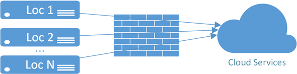
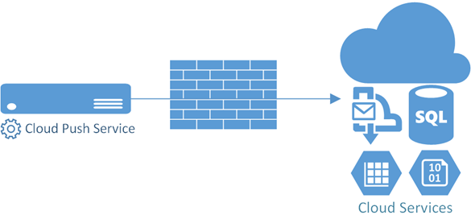
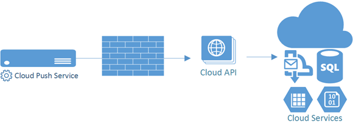
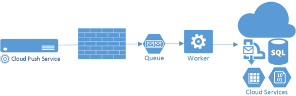

Let's explore and evaluate some mechanistic patterns for pushing data to the Cloud. Cloud providers such as Azure provide scalable storage solutions for storing massive amounts of structured and unstructured data. Successful companies are centralizing their data for enterprise-wide processing and analysis. One common application scenario is the manufacturing industry. They're using this data to benchmark performance, and even predict when equipment will fail. Technologies such as Hadoop are gaining popularity as companies are seeing the value in data aggregation and analysis.

###The Scenario

In this scenario, we have hundreds or even thousands of clients, located behind corporate firewalls, and they all need to push data frequently to a centralized location. This data is fairly generic, and includes data gathered from equipment, various meters, and even data from business/ERP systems.

I'm using Windows Azure as the cloud provider, and I'm using a Windows Service as the proxy for getting data to Azure. These principles remain unchanged for other cloud providers and other operating systems. You could just as easily use Node.js and Amazon. This information is less relevant for systems that are inherently updatable such as mobile apps that use an online store as a distribution mechanism (Windows 8 apps for example).

###Solution #1: Direct Push

Our first option is to push data directly into the azure services. This could be a storage mechanism such as SQL Azure, table storage, or blob storage. This simple approach has a number of advantages:

* Fast and easy to write the code  <li>Azure endpoints are already designed to automatically scale to limits that you're not likely to reach 

However, there are a number of significant disadvantages to this approach as well:

* In the rare case where an Azure API changes, the clients will most likely break
* There are limited options for compressing the data
* The Azure API is optimized to be flexible and generic, not business domain driven
* Portability to other cloud providers and/or other architectures is limited 

###Solution #2: Push to Business API

The easiest way to overcoming the disadvantages of the direct push approach is to create an endpoint in Azure to receive the data, and relay it to the backend services. This gives us 100% control over the communication channel, at least in the development phase.

Our API methods can be domain driven. Examples:

    [PUT] /api/meter_reading/{reading}/?timestamp={timestamp}
    [PUT] /api/equipment/{machine}/?name={machine_name}&amp;type={machine_type}&amp;class={machine_class}</pre>

In addition to solving all of the limitations of the direct connect scenario, this gives us some additional flexibility:

* You can add optimization features that the Azure API's don't support such as custom batching/streaming and proprietary compression algorithms
* You can control API version changes, including supporting multiple versions simultaneously
* As Azure adds or changes features, you can continue to optimize the backend architecture
* You can actually remain cloud provider agnostic by using a custom domain that **you own**

You do lose the inherent auto-scaling that the Azure services provide, but you can auto-scale your API nodes (web sites, web roles) as needed. You can even scale across subscriptions using the Azure Traffic Manager.

###Solution #3: Push to a Queue

There is a solution that combines the advantages of pushing to a business API with the advantages of pushing data directly. Instead of talking to API's, you can use a queue service whose interface is much less likely to change. In fact, there are queuing standards available such AMQP or [Advanced Message Queuing Protocol](http://en.wikipedia.org/wiki/Advanced_Message_Queuing_Protocol) which allow you to send messages using a standard protocol. Later, if we decide to switch providers, you just need to point our clients at a new queue address (which would require trivial code to automate). The Azure service bus supports the [AMQP protocol today](http://www.windowsazure.com/en-us/develop/net/how-to-guides/service-bus-amqp/).

While this solution _drastically_ minimizes the risk of change, there is still some risk in relying on continued support for a particular protocol.

The biggest advantage to this approach is the scalability you get without any management requirements. The current scalability targets are [2,000 messages per second, but you can scale further just by increasing the number of queues](http://msdn.microsoft.com/en-us/library/windowsazure/hh767287.aspx). You simply push messages to the cloud, and build a message processor that interprets the messages and sends them to the appropriate cloud services. Multiple versions of messages can be supported, and updating the backend processes is easily changed in one centralized location.

###Solution #4: Updatable Upload Code

In all of the previous strategies, the weakest link has been the process running behind the firewall. Without an automated update system, we end up supporting legacy systems indefinitely. Combining legacy systems with 3rd party services outside of our control is going to become an issue at some point.

There are far too many auto-update mechanisms available to cover here, but I want to share one design that is fairly easy to implement if you use [dependency injection](http://en.wikipedia.org/wiki/Dependency_injection) to decouple interfaces from implementations. In my case, I'm using Unity with automatic, convention-based wire-up.

This is the typical wire-up code that you would use in Unity:
    Container.RegisterTypes(
	AllClasses.FromAssembliesInBasePath(),
	WithMappings.FromMatchingInterface,
	WithName.Default,
	WithLifetime.ContainerControlled);

Notice that we're able to specify the assemblies to examine, and in this case it's all of the assemblies in the base path.

If we call RegisterTypes again, but this time specify a downloaded assembly (or multiple assemblies), we can overwrite the existing implementations. (The strategy for scheduling these updates is outside the scope of this post.)
    var newStuff = System.Reflection.Assembly.LoadFrom("NewStuff.dll");

    Container.RegisterTypes(
    	AllClasses.FromAssemblies(newStuff),
    	WithMappings.FromMatchingInterface,
    	WithName.Default,
    	WithLifetime.ContainerControlled,
    	overwriteExistingMappings: true);

This instructs unity to load all types that can from the new assembly. Any implementations in the new assembly will override the existing implementations. It can be as little as 1 class, or even replace all existing classes. Keep in mind that to use the new implementation, the IoC container must be queried again to get the new version. Ideally, the process should restart to ensure that all of the components have up-to-date implementations.