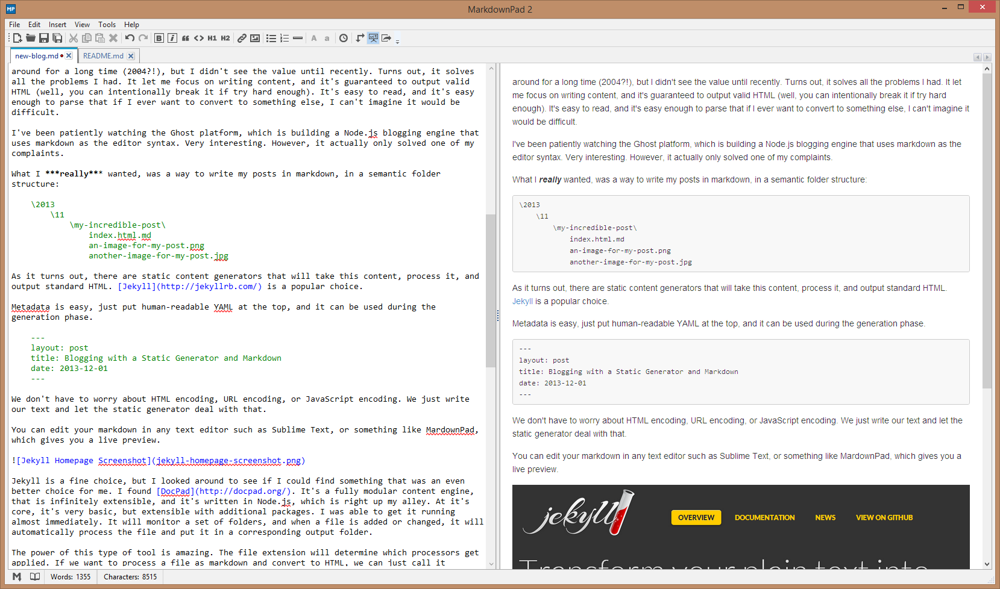
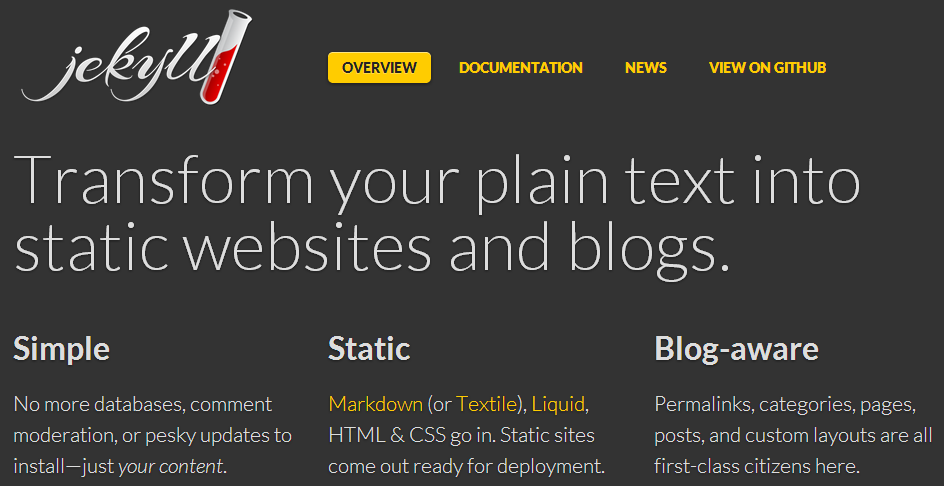
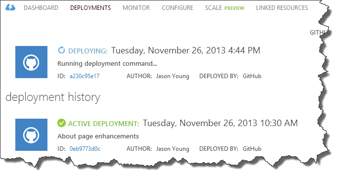
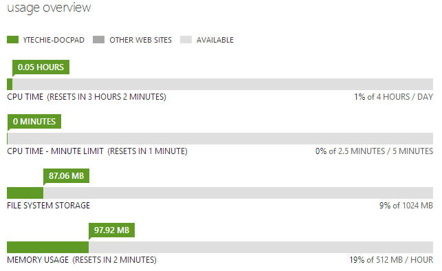

You'll notice I have a completely updated blog, and it's blazing fast! I've been through a lot of blogging platforms, and was never quite happy. Now, I've taken an entirely new approach that completely changes how I blog.

To show you just how fast it is, I can now spider every page on my blog, over 800+ pages, in 20 seconds or less:

### The Problem with Traditional Blog Engines

Blog engines typically work by generating pages on-the-fly from a database. As features get added, the code complexity increases, and the performance suffers. Web applications take the approach of generating their content at the last possible moment, when a request is made, while the user is waiting for their content. To solve this problem, the blog engines add yet another layer of complexity for caching. What we end up with is a beast like WordPress, with a massive caching solution like [W3 Total Cache](http://wordpress.org/plugins/w3-total-cache/).

Next, layer in the entire class of problems that are created when we throw versioning into the mix. If you're not up-to-date, you may be vulnerable to hacking attempts. If you *are* up-to-date, you may have broken something, meanwhile, your users get to read server errors.

How do you back up your blog? ***You do back up your blog right?*** Do you back up just the content, or do you back up the application and the content database? Databases are powerful, but must be managed, and when it comes to my blog that takes time away from writing content.

Post images are also more difficult than they should be. In WordPress, they're "kind of" associated with your post, but you have to get them there somehow, and then link them properly.

### Static Blog Generation from Markdown

In the past, I've used a number of tools to create blog posts. In the beginning, I used the best editor in the world, Notepad.exe. Then, I moved on to [Windows Live Writer](http://windows.microsoft.com/en-us/windows-live/essentials). I even tried the built-in WordPress editor. They all fell short. Writing HTML is easy as a developer, but writing **well-formed** HTML is not easy as a human. Many of my posts *looked* and rendered fine, but were missing a tag here or there.

When I used Live Writer, the HTML it generated was valid, but not very appealing. It felt wrong using it, and it never did handle images quite right. The naming was archaic, and by default the image would link to another copy of the same image. Syntax highlighting was also problematic. This was solved by using a Live Writer add-in, but the HTML it generated was far from ideal.

My latest obsession is [Markdown](http://daringfireball.net/projects/markdown/). I know it's been around for a long time (2004?!), but I didn't see the value until recently. Turns out, it solves all the problems I had with editors and HTML. It lets me focus on writing content, and it's guaranteed to output valid HTML (well, you can intentionally break it if try hard enough). It's easy to read, and it's easy enough to parse that if I ever want to convert to something else, I can't imagine it would be difficult.

I've been patiently watching the [Ghost platform](https://ghost.org/), which is a Node.js blogging engine that uses markdown as the editor syntax. Very interesting. However, it actually only solved one of my complaints.

What I ***really*** wanted, was a way to write my posts in markdown, in a semantic folder structure:

	2013
	|-- 11
	    |-- my-incredible-post
			|-- index.html.md
	    	|-- an-image-for-my-post.png
	    	|-- another-image-for-my-post.jpg

As it turns out, there are static content generators that will take this content, process it, and output standard HTML. (more on that below) My blog content is now **convention based** instead of configuration based. The top-level folders determine the nesting organization (I use year/month). The post folder name determines the post URL. All images are referenced locally and then rewritten as needed by the generator.

Metadata is easy, just put human-readable YAML at the top, and it can be used during the generation phase.

	---
	layout: post
	title: Blogging with a Static Generator and Markdown
	date: 2013-12-01
	---

We don't have to worry about HTML encoding, URL encoding, or JavaScript encoding. We just write our text and let the static generator deal with that.

To include code blocks, I simply indent them with a tab or 4 spaces per-line. 

You can edit your markdown in any text editor such as [Sublime Text](http://www.sublimetext.com/), or something like [MarkdownPad](http://markdownpad.com/), which gives you a live preview. I store the post drafts in Skydrive so that they're accessible anywhere. I can edit them on any computer, or my tablet with [Write RT](http://apps.microsoft.com/windows/app/writert/efc7bfe6-668e-4c4d-a42b-fc8f5ef7205d).

Note: To import my content from WordPress, [I created a rudimentary Node.js import tool](https://github.com/ytechie/wordpress-to-markdown).

###Static Generation

Jekyll is a fine static content generator, but I found a platform I like even better. [DocPad](http://docpad.org/) is a fully modular content engine that is infinitely extensible and written in Node.js, which is right up my alley. At its core, it's very basic yet highly extensible with additional packages. I was able to get it running almost immediately. During development, it will monitor a set of folders, and when a file is added or changed, it will automatically process the file and put it in a corresponding output folder.

The power of this type of tool is amazing. The file extension will determine which processors get applied. If we want to process a file as markdown and convert to HTML, we can just call it *myfile.html.md*. Want to process it with the CoffeeKup templating engine? Call it *myfile.html.coffee*. You can even chain extensions to process the file with multiple engines sequentially. Want to use a CSS processor like SASS then minifiy the result? Just call it *mystyle.css.min.sass*.

Ultimately, we end up with a completely static website that contains a semantic file structure for the source and output. The fact that the website is static but dynamically generated gives us some major advantages:

* We can host the site anywhere and it won't require any CPU power. Just bandwidth. We even have the option to host in a [CDN](http://en.wikipedia.org/wiki/Content_delivery_network), allowing the site to be served locally anywhere in the world.
* The site itself is unhackable. The site ***is*** content, we're no longer connected to the hosting engine.
* Versioning the site is easy. The files are text, and can be versioned easily in source control.
* The site itself is uncrashable. The web server can crash, but we don't have code that can crash.

### Amazing Automatic Deployment

I love Windows Azure for hosting. The fact that you pay only for what you use, a little or a lot, combined with power and simplicity make it an easy choice. Even though I work for Microsoft, this blog is my own, and I DO pay for it out of my own pocket.

I'm hosting my blog engine and the content in Azure, and I have [Azure Web Sites](http://www.windowsazure.com/en-us/services/web-sites/) configured to watch my repository, and [automatically deploy when changes are made](http://www.ewal.net/2013/10/10/deploying-docpad-sites-to-azure/). The swap is completely seamless, with zero downtime between versions.

Azure actually uses Node.js to run DocPad, generate the site, and then host it. After that, Azure simply serves out the static files, which IIS is extremely efficient at.

Here is my Azure usage **in production**. It could actually be used within the *free* tier of Azure (I may actually try that now).

### New Theme - Content is King

Content is king. Always has been, always will be. I wanted my blog to reflect that. In my old theme, I had the standard 2 column layout. The second column distracted from reading, made responsive design more difficult, and really served little purpose. The new design removes the chrome, and makes the content the focal point.

I can't take credit for creating the theme, I forked a [website repository](https://github.com/ervwalter/ewalnet-docpad) created by Erv Walter and used on [his blog](http://www.ewal.net/). This guy did ***amazing*** work [setting this up](http://www.ewal.net/2013/10/08/blogging-with-docpad/). I have since made many modifications to the source to work with my system.

### Comments

Comments are the one and only part of my blog that need to be dynamic. For this purpose, I turned to [Disqus](http://disqus.com/). Give it a try below!

I imported my comments and I was up and running. I'm happy to not have to deal with comment management and spam.

### Conclusion

I'm **really** liking this setup. I use *git* to manage the source code for my blog, which is saved on GitHub. I can make changes to my content, check them in, and they are automatically deployed. It feels a LOT more lightweight than any other platform.

You can see the [source for my blog in this repository](https://github.com/ytechie/ytechie-docpad). You can also fork it and use it for your own site within minutes if you like.

Give it a try!