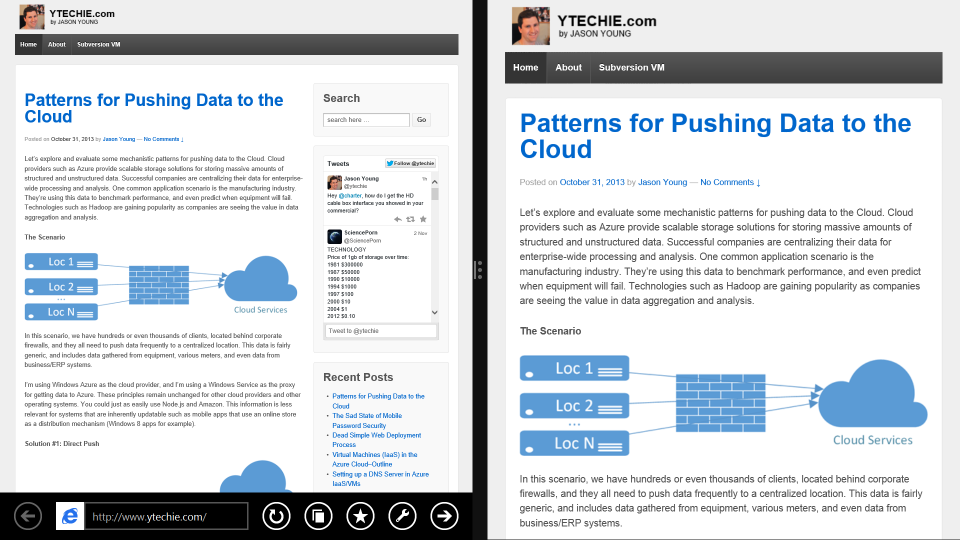
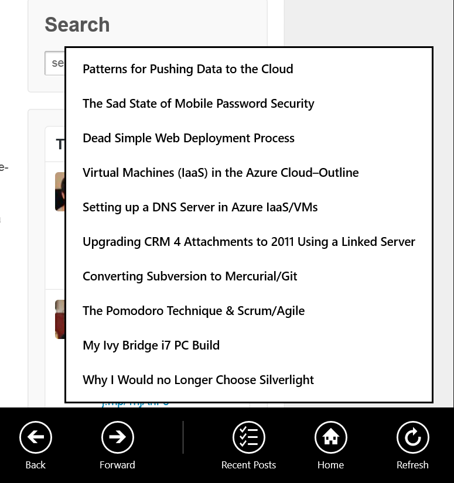

I'm currently working on a Windows 8 app for my package tracking site, [SimpleTracking.com](http://www.simpletracking.com). It's taking a long time to build, not because it's difficult, but because I'm trying to make the UI as useful as possible. In the meantime, I was looking for an app that I could quickly produce and get into the Windows 8 store. Wanting to play with the new WebView, I decided to build a wrapper for this blog, while adding enough value that it was a better experience than using a browser directly.

If you want to download the app, you can download it from the store with the name [YTechie Blog](http://bit.ly/1dQ2U0D).

###The New WebView Control

I never used the [WebView Control](http://blogs.windows.com/windows/b/appbuilder/archive/2013/07/17/what-s-new-in-webview-in-windows-8-1.aspx) in Windows 8, but I heard knew that the control was dramatically improved in 8.1. For example:

* New navigation control such as back, forward, stop, reload
* Fixed z-order issues
* Navigation interception

Embedding the WebView in my app was easy with this XAML:

    <WebView Name="WebViewControl" Source="http://www.ytechie.com"></WebView>

If we run this app with any website, and then pin it side-by-side with the Internet Explorer version, you'll notice something very interesting. The IE version is rendered as if the browser is the full width of the screen, and then the content is scaled 50%. The WebView in our app, however, is actually fitting the width available, and is rendering the page at 100%. You'll notice that the responsive design of the page is kicking in, providing a better experience.

Next, I added a busy indicator using the [ProgressRing](http://msdn.microsoft.com/en-us/library/windows/apps/windows.ui.xaml.controls.progressring) control. I centered the progress ring over the content with a higher z-index and some transparency. The goal was to make the indicator visible, but not obtrusive.

    <ProgressRing Name="BusyIndicator" Height="100" Width="100" Background="White" BorderThickness="3" Padding="5" Opacity=".5" Visibility="Collapsed"></ProgressRing>

Then, I subscribed to the new navigation events:

    WebViewControl.NavigationStarting += WebViewControlOnNavigationStarting;
    WebViewControl.NavigationCompleted += WebViewControlOnNavigationCompleted;
    
When the WebView begins navigating, we want to display the progress indicator. Additionally, I wanted to take advantage of the fact that this is an app, and not just a website. If the user clicks on a link that navigates to another page within my blog, we'll simply take them there. However, if they click on an external link, we'll open it in the new Windows 8.1 side-by-side mode. This lets them maintain their current place, but read any supplementary information that is available. It's also easy for the user to switch back to full screen made for either app.

To indicate that we want to use the side-by-side view, we tell the URI launcher with the [DesiredRemainingView](http://msdn.microsoft.com/library/windows/apps/dn298314) flag set to [UseHalf](http://msdn.microsoft.com/en-us/library/windows/apps/windows.ui.viewmanagement.viewsizepreference).

    private async void WebViewControlOnNavigationStarting(WebView sender, WebViewNavigationStartingEventArgs args)
    {
    	if (args.Uri.Host.EndsWith("ytechie.com", StringComparison.CurrentCultureIgnoreCase))
		{
        	BusyIndicator.Visibility = Visibility.Visible;
           	BusyIndicator.IsActive = true;
            return;
		}

		args.Cancel = true;
		await Launcher.LaunchUriAsync(args.Uri, new LauncherOptions {DesiredRemainingView = ViewSizePreference.UseHalf});
	}

###Rejected

I added my screenshots, added my app description, and rushed through the entire app submission processed. Within a few hours, I received an email saying that my app certification **failed**. Here are the details of the report I received:

> Your app doesn't meet requirement 1.1.
>
> * The value or usefulness of the app is not clear.
> * The app is only valuable or useful in a subset of the languages that it claims to support.
>
> Your app doesn't meet requirement 4.1.
>
> Notes from Testers:
> 
> The app has declared access to network capabilities and no privacy statement was provided in the Description page. The app has declared access to network capabilities and no privacy statement was provided in the Windows Settings Charm. This app didn't appear to provide value or didn't seem useful to the reviewer.

**Ouch!** Admittedly, I had rushed this through, and I expected problems. Time to fix it.

###Privacy Policy

This one is extremely common. If you use network functionality at all, a privacy statement is required. Fortunately, this is very easy to fix in Visual Studio 2013. Add a new file of type "Settings Flyout".

Change the text and add in a privacy policy. Here is a template I found on the web:

> This application does not share personal information with third parties nor does it store any information about you.
> This privacy policy is subject to change without notice and was last updated on DATE. If you have any questions feel free to contact me directly at EMAIL

Now just wire up the new settings flyout in the *App.xaml.cs* by overriding the *OnCommandsRequested* method.

	private void OnCommandsRequested(SettingsPane sender, SettingsPaneCommandsRequestedEventArgs args)
	{
		var privacy = new SettingsCommand("PrivacyPolicy", "Privacy Policy", (handler =>
		{
			var pp = new PrivacyPolicy();
			pp.Show();
		}));
		args.Request.ApplicationCommands.Add(privacy);
	}

###More Functionality

Now, let's get back to making this app more useful. Admittedly, I rushed through the app submission process. This time, I took the time to add more than a single screenshot, and I also clearly articulated the reason why this app is better than using a browser directly.

I also added a forward and back button to the bottom AppBar.

Then, I added a recent posts button, that uses a [MenuFlyout](http://msdn.microsoft.com/en-us/library/windows/apps/hh780659.aspx). I wanted this menu to lazy load the first time it was tapped, so I added an event handler for *Opening*. The code turned out to take longer than expected. Because of the way that the menu renders, I had to create all of the menu items ahead of time and hide them.

    private void RecentPosts_Loading(object sender, object e)
    {
        var menuFlyout = RecentPosts.Flyout as MenuFlyout;

        if (menuFlyout == null)
            return;

        var menuFlyoutItems = menuFlyout.Items;

        if (menuFlyoutItems == null)
            return;

        //Check if we already loaded this list
        if (menuFlyoutItems.Count > 0)
            return;

        var menuItems = new MenuFlyoutItem[10];
        for (var i = 0; i < 10; i++)
        {
            var item = new MenuFlyoutItem { Text = "Loading recent posts..." };

            if (i > 0)
                item.Visibility = Visibility.Collapsed;

            menuItems[i] = item;
            menuFlyoutItems.Add(item);
        }

        ReadLatestPosts(menuItems);
    }

Then, the *ReadLatestPosts* method reads the items from the RSS feed, and populates the pre-created items:

    private async void ReadLatestPosts(MenuFlyoutItem[] menuItems)
    {
        var feedClient = new SyndicationClient();

        try
        {
            var feedData = await feedClient.RetrieveFeedAsync(new Uri("http://ytechie.com/rss"));

            var itemNumber = 0;
            foreach (var feedItem in feedData.Items)
            {
                if (itemNumber < 10)
                {
                    menuItems[itemNumber].Text = feedItem.Title.Text;
                    menuItems[itemNumber].Visibility = Visibility.Visible;

                    //We have to run this on the UI thread:
                    menuItems[itemNumber].Click += (sender, args) => Dispatcher.RunAsync(CoreDispatcherPriority.Normal, () =>
                    {
                        var url = feedItem.Id;
                        WebViewControl.Navigate(new Uri(url));
                    });
                }
                itemNumber++;
            }
        }
        catch (Exception)
        {
            menuItems[0].Text = "Error Reading Feed!";
        }
    }

The end result is that the app lazy loads the recent posts and renders the items on the fly. The experience is very fast and doesn't feel laggy.

###Resubmission

I submitted the app again, and this time it passed the certification stage. In fact, it took less than 5 hours for the app to go through the entire certification process and show up in the app store.

I plan on adding additional features such as a live tile of new posts, push notification support, and possibly some enhanced navigation features. It makes for a great place to learn about Windows App development. If no one downloads my app, that's alright. There are plenty of opportunities for