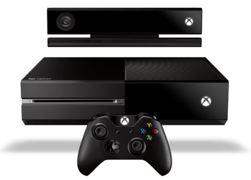
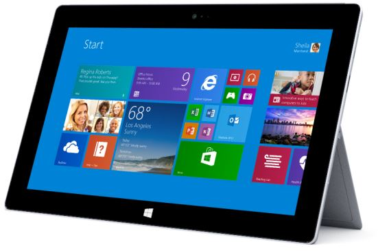
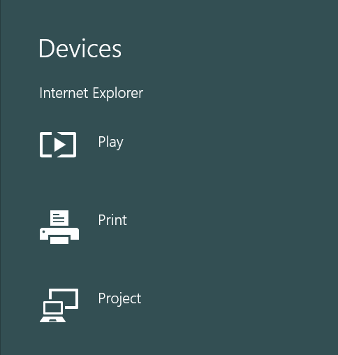
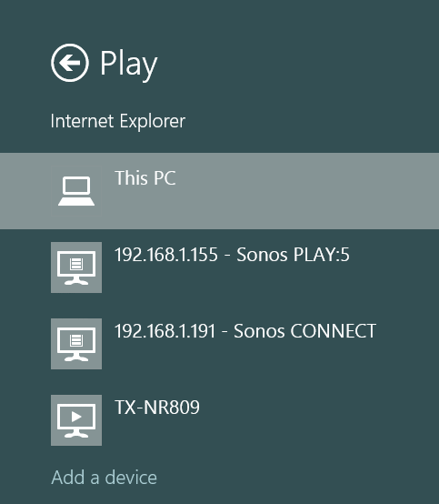
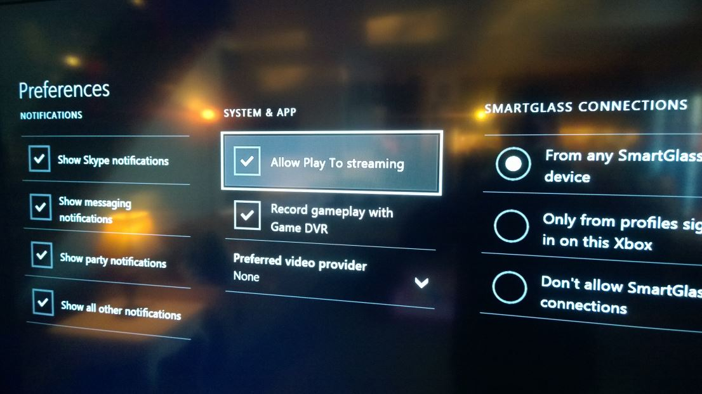
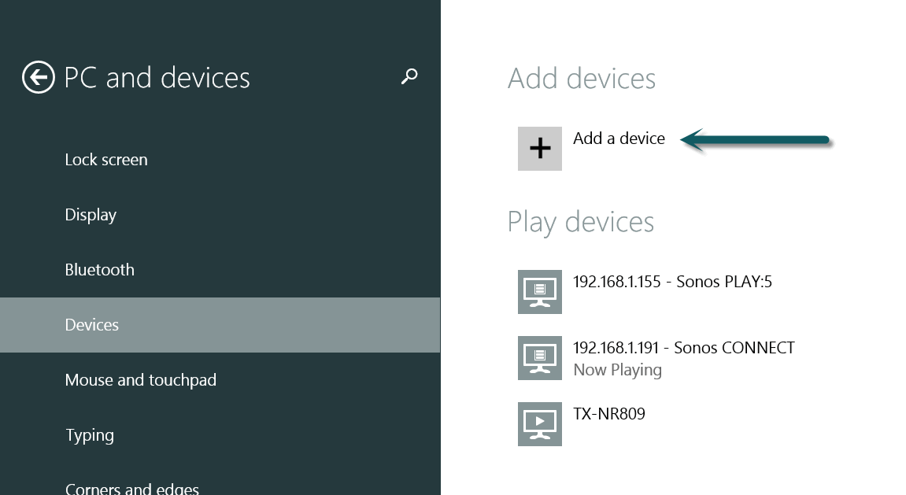
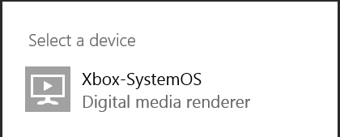
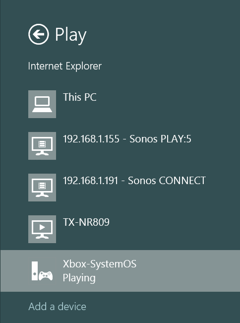

The Surface family of devices (or any device/PC running Windows 8) is capable of wirelessly sending video content from many modern applications to an XBox One on the same network using a technology known as *Play To*. *Play To* is particularly useful for streaming video from your browser. Setting it up is quick and easy, but not terribly intuitive.

 

You may have also heard the term Miracast. Miracast is a different technology and is essentially a peer-to-peer, Wi-Fi Direct HDMI cable. In other words, a wireless monitor. Miracast is superior in the fact that it works with all applications without modification. Unfortunately there are only a couple of Miracast receivers on the market today, and this technology is outside the scope of these instructions.

Projecting applications is done by swiping in from the right to display the charms bar, and selecting devices. You'll get the menu below:

While in an application that supports it, selecting the *Play* menu presents you with the available output devices:

Noticeably missing is the option for the XBox. Unfortunately this isn't quite as automatic as the [Apple AirPlay](http://www.apple.com/airplay/) system. We have to set a few things up first to get it to show up here.

First, confirm that *Play To* is enabled on your XBox by using the *Settings* app, and selecting *preferences*. There you'll see the option to enable *Play To*. 

Go back to your Surface and reopen the charms bar and select *Devices*, and then *Play*, just as you did before. This time select *Add a device*. This is a deep-link into the settings app.

From this screen, select *Add a device*:

It should detect the XBox One:

>If your XBox doesn't show up, ensure that you're on the same subnet, and confirm that your network is open and test by using the [SmartGlass](http://apps.microsoft.com/windows/en-us/app/xbox-one-smartglass/c3a46cb8-e733-4579-b716-862e123fa831) application to confirm connectivity.

After a bit of installation, the XBox One should show up in the list of *Play* Devices. Once it's showing up, open up [YouTube.com](http://www.youtube.com) in Internet Explorer, start playing a video of your choosing, and select your XBox as the *Play To* target:

Selecting the XBox system will cause the currently playing video to display on the XBox. Once the initial handshaking is done, you can switch videos, and even allow the Surface to go into standby, and the video will keep playing. Keep in mind that there are a limited number of applications that have *Play To* support. If your favorite application is lacking support, be sure to reach out to the author and ask them to [add it](http://msdn.microsoft.com/en-us/library/windows/apps/hh465176.aspx).