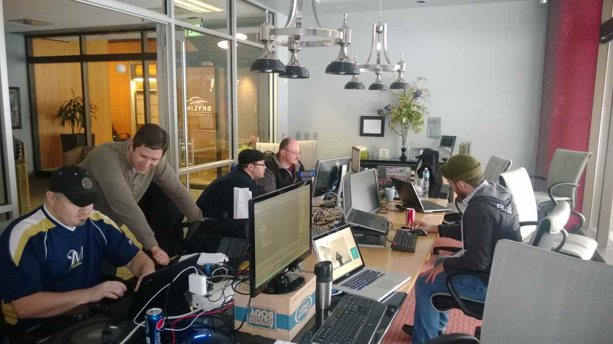

I'm working on a new project that will demonstrate how the current and future trends in manufacturing can be enabled by Windows Azure and Windows 8. I'll be sharing more information in the future.

We decided to have a weekend [Hackathon](http://en.wikipedia.org/wiki/Hackathon) with [Skyline Technologies](http://skylinetechnologies.com/) to kickstart the project. I recently had someone ask me a few questions to help run these in the future. I decided to write this up to reach a wider audience.

Now, there may be some confusion as to what a Hackathon actually is. The [compendium of human knowledge](http://en.wikipedia.org/wiki/Hackathon) suggests that they come in all shapes and sizes. In my particular case, the goal of ours was to dive in and start writing code without being slowed down by process or restrictions, allowing the ideas to flow.

>A Hackathon (also known as a hack day, hackfest or codefest) is an event in which computer programmers and others involved in software development, including graphic designers, interface designers and project managers, collaborate intensively on software projects.

>Hackathons typically last between a day and a week. Some hackathons are intended simply for educational or social purposes, although in many cases the goal is to create usable software. Hackathons tend to have a specific focus, which can include the programming language used, the operating system, an application, an API, or the subject and the demographic group of the programmers. In other cases, there is no restriction on the type of software being created.

Now that some time has passed and the dust has settled, I can look back and see what made this successful, and how we could have improved.

## 1. Meet 6 Weeks in Advance

It's good to have your first meeting well in advance of the Hackathon if possible. Each pre-meeting will add additional definition to the hackathon plan.

This is the time when you need to start signing people up and getting commitments that they'll be there. This is also a good time to talk about the high level goals of the project. The goals and the participants will start to align early if well executed.

Ideally, you'll have a mix of devs, preferably with diverse backgrounds. Also keep in mind what subject matter experts will be most helpful for your requirements.

## 2. Meet 4 Weeks in Advance

4 weeks in advance, start confirming some of the details. Any last minute developer changes? What are the exact places and times that people should show up? Start talking about what will actually be delivered as a result of this hackathon, and how that matches the commitments.

## 3. Create Your Solution & Dependencies

In my experience, every Hackathon starts with an hour or more of people getting their machines configured properly. Getting their system up-to-date, connecting to source control, pulling the source, and installing dependencies. Not only does it waste precious time, it immediately drops productivity.

I've seen this problem solved with virtualized development environments. You create a reference image, and then each person copies and runs a clone of the image. This speeds up the process, but still doesn't get us past issues with permissions, pulling the source, and building.

The best solution I have found is to set up the solution ahead of time, referencing all of the required dependencies. If the solution needs the Windows 8 SDK, include an empty Windows 8 project. If it needs Azure components, create a cloud service. In your pre-hackathon meeting, make sure that everyone knows **they should have the solution building before showing up for the event**. By setting the expectation to be ready ahead of time, we can avoid the time consuming process of downloads and installs.

Setting up the solution ahead of time also has the added benefit of avoiding the merge conflicts that are more likely at the beginning of a project.

## 4. Meet 1 Week in Advance

A week before the hackathon, this is your last chance to tie up any loose ends. This is also a good time to talk about prerequisites, so that everyone can get their development machines properly setup.

## 5. Have a plan for food

People need to eat. Provide lots of options, and make sure that food is timely and plentiful. Make sure there are no special dietary requirements. You'll also want to make sure that there are a variety of drinks available, so that people can stay hydrated and caffeinated.

## 6. Network Switch & Other Hardware

The rule in my house is that if a device doesn't move, it must have an Ethernet cable run to it. Wi-Fi is only for devices that move frequently such as phones, tablets, etc. When it comes to video calling, sharing files, and Internet access, there is simply no substitute for a hard-wired connection. Have plenty of switches and cables available so that everyone gets a port.

You should also have extra monitors, USB hubs, mice, keyboards, and lots of various cables on hand. Have plenty of whiteboards with working markers, and a projector that anyone can hook up to. You want to make working and sharing as frictionless as possible.

## 7. Have Someone Present that is Accountable

People who attend hackathons show up ready to work. If they didn't want to be there, they would probably have stayed home. That being said, there should be a designated person whose primary goal is for the overall project to be successful.

There will also be lots of decisions that need to be made, and not a lot of time to make them. Discussions should occur, but often times making a bad call is worth it to keep things moving. Having someone that can provide answers is critical.

**Have fun!**