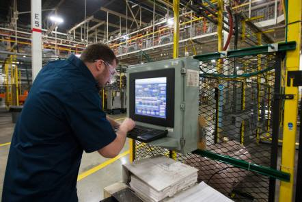
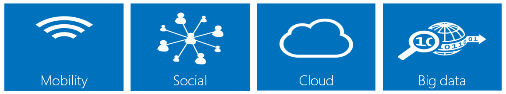
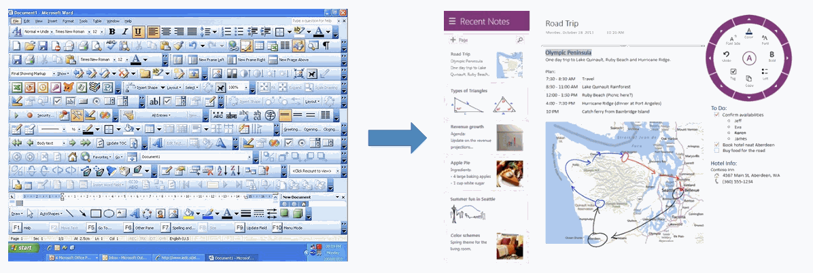

Manufacturing is responsible for the clothes you wear, the products you use every day, and has assembled nearly every object in the room with you right now. Data, data, data - Manufacturing is responsible for generating Exabyte's of data that gets collected, stored, and analyzed every year. That's far more data than any other sector.

In my role with Microsoft, I'm working with commercial software vendors on a daily basis to help them build cloud solutions. Manufacturing is becoming extremely competitive, to the point where the only survivors are those that can efficiently mine the insights from their data in real-time and adapt/react quickly. Thanks to technology, manufacturers in the United States have become the [most productive in the world][1].

[1]: http://www.nam.org/Statistics-And-Data/Facts-About-Manufacturing/Landing.aspx "Facts About Manufacturing in the United States"

Within the [Technology Evangelism & Development (TED)](http://www.zdnet.com/microsoft-builds-a-deep-tech-team-to-attract-next-gen-developers-7000015270/) team, we're working hard to identify common patterns where we can build reusable open source frameworks. My goal is to bring these frameworks together in the context of manufacturing, while filling in some of the holes that exist currently. Microsoft already has a [reference architecture for Discrete Manufacturing](http://www.microsoft.com/enterprise/industry/manufacturing-and-resources/discrete-manufacturing/reference-architecture/) (DIRA). While the goals of the DIRA project are similar, our project complements those patterns with a concrete implementation showcasing Microsoft technologies.

## Manufacturing Landscape & Trends

Data collection in manufacturing is rooted in technologies whose protocols were [developed decades ago](http://en.wikipedia.org/wiki/Modbus). Traditionally, data collection and storage has been siloed by physical location. Companies with multiple facilities have struggled with not just getting their data into a central location, but storing and processing that data at scale. Cloud computing can provide a centralized storage location and the scaleable processing required to make sense of it.

When you look at the design of software that has been around for a decade or more, you'll see that as an industry we've gotten really good at adding features. Historically this meant adding more buttons to toolbars or menus. Modern software design requires us to focus on usability. In manufacturing, this means designing intuitive role-based displays. Mobile software has taught us that focused simplicity can be a valuable advantage. Less training means lower costs for new employees, and makes it easier to collect the right information from the right people.

## This framework is...

* focused on the MES portion of discrete manufacturing.
* an end-to-end data pipeline capable of pulling data from existing systems (using adapters) and ultimately display that information and provide self-service business intelligence.
* decomposable - components are interface-based so that any portions can be used individually. Use as little or as much as you like.  
* extensible - because of the modular design approach, the framework can be extended limitlessly.
* open source - it will be licensed under the MS-PL.
* using Microsoft technologies such as Windows Azure and Windows 8, although non-Microsoft technologies will be used where appropriate.
* aligned with tomorrows manufacturing trends such as [Industry 4.0](http://en.wikipedia.org/wiki/Industry_4.0).

## This framework is not...

* competing with other Microsoft efforts. It's meant to fill in gaps, not replace existing solutions in development.
* the best way to push data. It simply demonstrates one possible solution.
* the best way to store data. It simply demonstrates one possible solution.
* The best way to process data. It simply demonstrates one possible solution.
* embedded. This framework is a level above the embedded device ecosystem, but can use data generated or collected by devices.

## Going Forward

For now, my goal was to simply introduce the project. I'll be working on a series of blog posts discussing the architecture and the various goals. Be sure to [subscribe](/feed/) for updates!