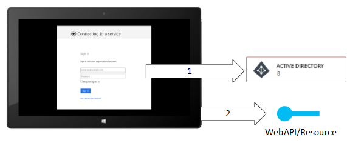
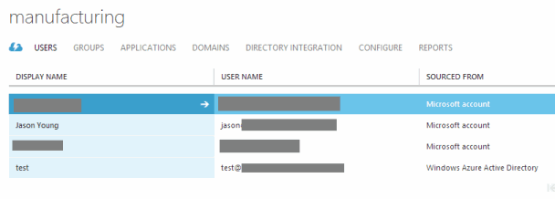
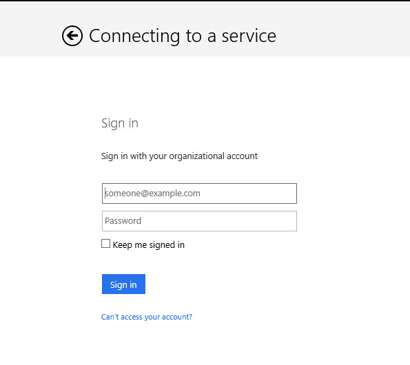

In a hackfest this past weekend, I integrated Windows Azure Active Directory (WAAD) into the [manufacturing project](http://www.ytechie.com/2014/02/introducing-the-modern-manufacturing-framework/) I'm working on. This is meant as a gentle introduction and is not a comprehensive guide to adding authentication to your application. The application consists of a Windows 8 Store application and a WebAPI backend that interfaces with the rest of the backend systems.

In the early days of .NET, we had to create our own database of users and manage all aspects of getting them logged in. .NET 2.0 introduced ASP.NET membership, which let us offload most of the work. Now, we offload all of the work to WAAD.

###What is [WAAD](http://www.windowsazure.com/en-us/services/active-directory/)?

WAAD gives us a user directory (and more) and makes it easy to integrate a secure login to your applications with very little work.

Unlike the on-premise version of Active Directory, this is purely for user authentication, not machine authentication (yet).

**Long Description:**

> Enterprise level identity and access management for all your cloud apps. Windows Azure Active Directory is a comprehensive identity and access management cloud solution. You can manage user accounts, synchronize with on-premises directories, get single sign on across Azure, Office 365 and hundreds of popular SaaS applications like Salesforce, Workday, Concur, DocuSign, Google Apps, Box, ServiceNow, Dropbox, and more.

### Adding a Login Screen
In our Windows 8.1 application, Login.xaml is the first page we navigate to. The key in this page is that it calls `AcquireTokenAsync`. This method handles the whole authentication process for us, including bringing up the login dialog:

	var authContext = new AuthenticationContext("https://login.windows.net/" + authConfig.DirectoryDomain);
	var result = await authContext.AcquireTokenAsync(authConfig.AppRedirectUri, authConfig.AppClientId, new Uri(authConfig.ApiAppSignOnUrl));

> **Let me repeat this in case it's not sinking in.** One line of code has given us an entire functional login dialog!

This is part of the Windows Azure AD Authentication Library for .NET and available through a [pre-release NuGet](http://www.nuget.org/packages/Microsoft.IdentityModel.Clients.ActiveDirectory/).

(**Pro tip:** Call [TokenCacheStore](http://msdn.microsoft.com/en-us/library/microsoft.identitymodel.clients.activedirectory.authenticationcontext.tokencachestore.aspx).Clear() on your [AuthenticationContext](http://msdn.microsoft.com/en-us/library/microsoft.identitymodel.clients.activedirectory.authenticationcontext.aspx) during WAAD development to clear your cached credentials to force it to authenticate you each time)

Of course `AcquireTokenAsync` requires parameters that we configured in our WAAD instance. Fortunately we’re using the [ConventionConfig library](https://github.com/ytechie/ConventionConfig) (shameless plug) to store and share our configuration details. This gives us a great centralized location to keep track of the settings we supplied when we configured the directory application.

When the authentication succeeds, we get back a result that has some useful information. First, it contains a bearer token. This is a token that we’ll put in our HTTP calls to prove our identity. We also get a UserInfo object back that contains things like first/last/email.

To make it easy to handle the bearer token, I subclassed the HttpClient like so:

	public class SecureHttpClient : HttpClient
	{
		public SecureHttpClient(string bearerToken)
		{
			DefaultRequestHeaders.Authorization = new AuthenticationHeaderValue("Bearer", bearerToken);
		}
	}

Now we can make secure we calls like this:

	var secureHttpClient = new SecureHttpClient(app.BearerToken);
	var response = await secureHttpClient.GetAsync("http://localhost:3184/api/echo?whoami=true");

If we don’t pass the bearer token, we’ll get a 401 (we'll configure the WebAPI in a moment).

	var httpClient = new HttpClient();
	var response = await httpClient.GetAsync("http://localhost:3184/api/echo?whoami=true");

If you're using an IoC container, or you don't feel comfortable inheriting from HttpClient, you could also use a factory method to create a configured HttpClient.

###In the WebAPI

In the WebAPI project we use [OWIN](http://owin.org/) to allow easy injection of middleware. In this case, I’m referencing `Microsoft.Owin.Security.ActiveDirectory`. In an OWIN startup task, we call the following:

	app.UseWindowsAzureActiveDirectoryBearerAuthentication(
		new WindowsAzureActiveDirectoryBearerAuthenticationOptions
		{
			Audience = config.ApiAppId,
			Tenant = config.DirectoryDomain
		});

Now, it’s just a matter of using the built-in WebAPI authorization functionality. We can put an `[Authorize]` attribute on a controller or action, or just make everything require authorization by default (probably the best way).

	[Authorize]
	public string Get(bool whoAmI)
	{
	...

In an API action, we can get information about the user through the standard `ClaimsPrincipal.Current property`.

It’s pretty amazing once you get everything in place.

### Valuable Resources I Used

* [Vittorio Bertocci's Cloud Identity Blog](http://www.cloudidentity.com/blog/) - This turned up in a lot of searches with valuable information.
* [ADAL - Windows Store app to REST service - Authentication](http://code.msdn.microsoft.com/windowsapps/ADAL-Windows-Store-app-to-e9250d6f/)
* [Active Directory Authentication Library](http://www.nuget.org/packages/Microsoft.IdentityModel.Clients.ActiveDirectory/)