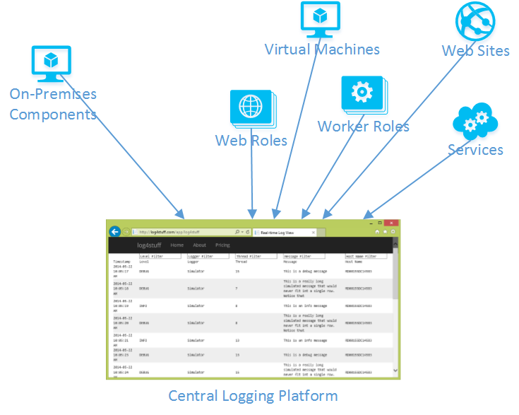
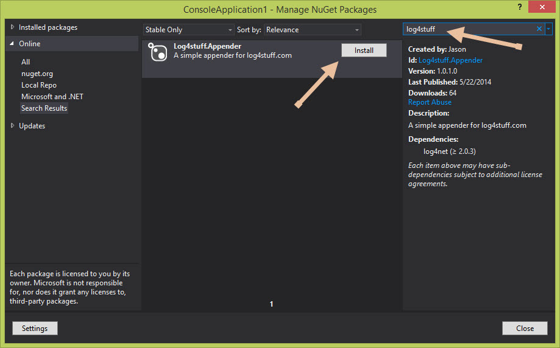
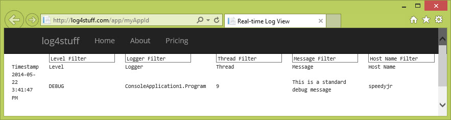

When working with developers that are building cloud-first applications, I've found that they want real-time insights into their executing code. In the past, I was able to use tools like [Log2Console](http://log2console.codeplex.com/), but this type of tool only works when you are on the same machine as the executing code, or if there is a direct route with no firewalls. 

## The Need

There are lots of great solutions for gaining insights into your distributed applications, but I wanted a **dead-simple, low-friction** way of adding logging to a new or existing application.

Imagine if we could simply do the following

1. Add a [NuGet package](https://www.nuget.org/packages/Log4stuff.Appender/) to our solution
2. Add 1 line of code in our application startup code
3. Go to a website and get real-time log messages without having to sign up

I set out to build a simple tool to make this a reality.

## Getting Started

Let's see what it takes to set this up.

In my example, I'm going to create a brand new project, but you can easily add this to any existing project type such as a web site, web role, worker role, etc.

### 1. Add the NuGet Package

Right-click on your project and select "Manage NuGet Packages"

Search for "log4stuff" in the search box and click "Install" on the "Log4stuff.Appender" package.

### 2. Configure your Application

Your application ID is just a unique way of identifying your application so that you can view your logs. It can be anything you want, there are no restrictions, and it's case sensitive. In my example, I'll use *myAppId*.

I'm going to add just a single line of code in the application startup:

        static void Main(string[] args)
        {
            Log4stuff.Appender.Log4stuffAppender.AutoConfigureLogging("myAppId");
        }

This automatically configures Log4Net in your application, and it also redirects the .NET trace logs into Log4Net. Recently I used this with the [Orleans](http://research.microsoft.com/en-us/projects/orleans/) code to intercept the existing logging. If you have already configured Log4Net in your application, you can find integration [instructions here](http://log4stuff.com/Apps/Configure/myAppId).

Now, you can use the standard Log4Net mechanism for logging, which typically involves adding a logger declaration into each class:

	private static readonly ILog Log =
		LogManager.GetLogger(MethodBase.GetCurrentMethod().DeclaringType);

And then use the standard log methods for logging:

	Log.Debug("This is a standard debug message");

Here is the code from our application in its entirety:

	using System.Reflection;
	using log4net;
	
	namespace ConsoleApplication1
	{
	    class Program
	    {
	        private static readonly ILog Log =
				LogManager.GetLogger(MethodBase.GetCurrentMethod().DeclaringType);
	
	        static void Main(string[] args)
	        {
	            Log4stuff.Appender.Log4stuffAppender.AutoConfigureLogging("myAppId");
	
	            Log.Debug("This is a standard debug message");
	        }
	    }
	}

### 3. View your Logs

Now, just go to the Log4Stuff website and use your application ID, in this example, you would use:

[http://log4stuff.com/app/myAppId](http://log4stuff.com/app/myAppId)

When you run your console application, you'll see the log message appear in near real-time:

Now you can imagine instrumenting the various components of your cloud application, and you'll have the ability to watch data as it flows through the system. UDP packets are used to get messages to the site, and the site uses SignalR, so the total latency is minimal.

Happy Logging!

### Links

* [More information on the Log4Net open source project.](http://logging.apache.org/log4net/)
* [Log4Stuff.com](http://log4stuff.com/)
