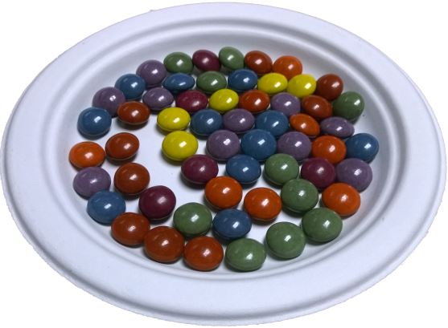
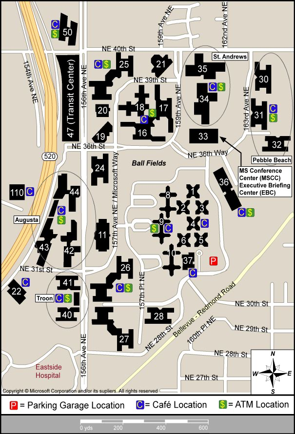
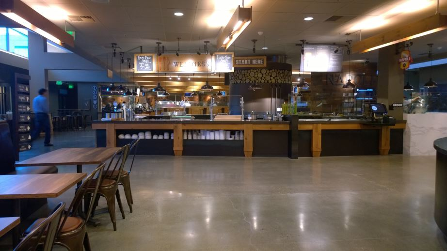
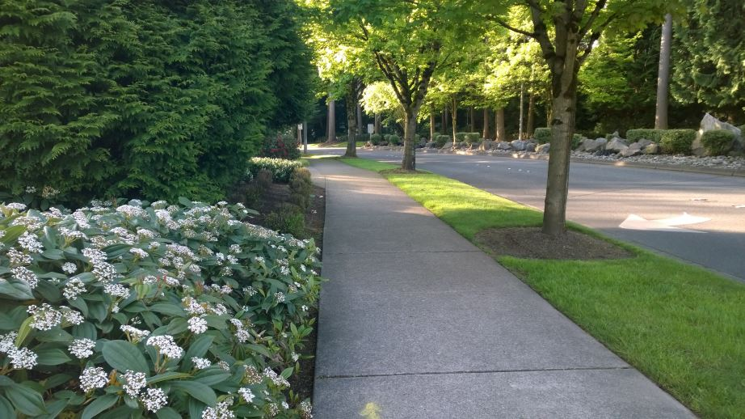
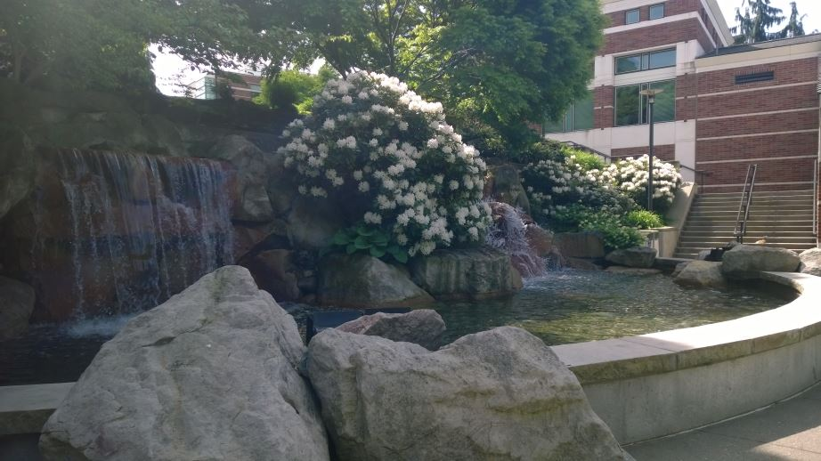

One year ago today, I started my journey as a Microsoft employee. It has been one of the most interesting and exciting years of my career. I thought this would be an ideal time to take a look back. Let's go back in time to before I started.

(it's tradition to bring in 1 pound of candy/M&M's for each year anniversary)

I have a long history with Microsoft products and development tools. I loved the company long before working here. When a former colleague and now Microsoft employee suggested applying for an open position, I couldn't pass up the opportunity.

### The Interview

Interviews at Microsoft are legendary. Famous puzzles and white-boarding challenges have made the process famous enough for someone to [write a book about it](http://www.amazon.com/How-Would-Move-Mount-Fuji/dp/0316778494/ref=sr_1_1?ie=UTF8&qid=1401755691&sr=8-1&keywords=microsoft+interview).

After passing multiple technical phone interviews, they flew me out to Redmond for a "loop", which is a series of diverse interviews.

As I arrived at the airport to fly out, I got call from my wife telling me that my oldest son had fallen "off" our staircase. He didn't fall *down* the staircase, he literally fell over the handrail to the floor below. We kept calling each other for updates as the ambulance arrived and took him to the hospital. It was really difficult to make the call if I should go back home, or catch my flight to the interview.

Right before the cabin door closed on the plane, I got the call that there were miraculously no broken bones, just bruising. I decided to continue with the flight to Redmond. Kids are amazing healers, and he was back to school in just 2 days.

I won't go into a lot detail about my interview loop, but I will tell you it was the most comprehensive, well-rounded set of interviewers and interview topics that I've ever faced. I believe the key to a good interview is to not treat it as an interrogation. It's much more useful to both parties to have engaging discussions. I had some whiteboard discussions, and even had some disagreements about technical topics.

I got my questions answered, although the MS org chart itself can be very intimidating to outsiders, so you never fully understand what you're getting into.

At the end of the loop, I ended up having an amazing discussion with John Shewchuk, one of the "technical fellows" in the company. A title given to a select few technical leaders within the company. He was the last gate to getting an offer.

### Drinking from the Firehose

The tales of drinking from the proverbial firehose are absolutely true. The amount of information available, on the Intranet, distribution lists, roadmaps, presentations and the smartest people I have ever met, provide you with everything your brain can absorb. Your constantly encouraged to move outside of your comfort zone, expand your knowledge, and find your particular niche.

I recently watched a Pluralsight video titled [Developing a Killer Personal Brand](http://pluralsight.com/training/courses/TableOfContents?courseName=developing-killer-personal-brand). One of the core concepts was to realize what you want to be known for. In my case, I specialize primarily in Azure, so I've been trying to focus on how to create the right taglines and introductions so that when I'm speaking with someone, they understand what my main focus is.

### Working Here

Working here is amazing. Since my assigned partners are located at various locations across the US, I'm fortunate to be able to work from my home. I have a great home office setup and for the most part I keep regular work hours. When my doors are closed, my kids know that daddy is *at work*. It takes a lot of adjustment going from working in a busy office to working at home. The advantage is that I have a 5 second walk to work, and everyone is a Lync call away. The downside is missing the hallway discussions, and being able to walk down the hall to get a question answered.

A couple of times per year, I go to Redmond for "sync week", a time when we work together to learn and share experiences to help us work more efficiently. These weeks are highly valuable, and it's my chance to hear the information I don't hear in formal meetings.

The Redmond campus is unbelievable. The 140+ buildings are top notch and run like clockwork. Getting between buildings is as easy as summoning "connector" car with your phone. Within minutes, it shows up and takes you to your destination using a computerized logistics system. The free soda/coffee is on every floor of every building. The *commons* has dozens of great restaurants, as well as cellular stores, a salon, bike shop, tech support, and more. Everything is built around keeping everyone productive.

Groups of building share a Cafe, so they're never far away:

There are miles of walking trails:

An outdoor waterfall at one of the buildings:

### Being Successful at Microsoft

Since I've only been here a year, I certainly can't say I'm the authority on what makes someone successful. From what I've seen, the common trait is pure passion around our products. No one is here primarily for the money, and if they are, they don't tend to stick around. The people here don't just think about the products, they *can't stop* thinking about them. Time and time again you see people changing the world though the work they're doing here. We cross every industry in virtually every geographical location.

I work for a part of Microsoft known as TED (technology evangelism & development), which is part of DX (developer experience & evangelism). I work very closely with a small set of partners (5 currently) to help make technology and architecture choices, primarily around Azure and Windows. Azure has grown very quickly since it's inception, and I help developers navigate and align the vast list of features. I also get to write code for open source frameworks that can multiply the effectiveness our efforts and help a broader set of partners.

Being able to write code, and help others build and deliver amazing applications makes this my dream job.

I often get asked how to get a career at Microsoft. First, it should be immediately obvious that you fit in here. Your work and your enthusiasm should make your talents apparent. Next, find area you want to focus on, whether it's a product group, or evangelism. Then, head over to [Microsoft Careers](http://careers.microsoft.com) and do some searches for positions you may be interested in. The best way to get into any company is through networking. Find someone you know with connections to Microsoft, and see if they're aware of any positions that you may be a great fit for.

### What's Next

One of the best things about working for a big company is having the ability to switch jobs without leaving the company. I'm having a great time working in DX (developer experience & evangelism), but it's great knowing there are lots of lateral opportunities as well as growth opportunities. Want to help build Windows? Office? XBox? SQL? It's an impressively diverse set of products all in one company.

Right now I'm just enjoying the ride and I'll see where it takes me.