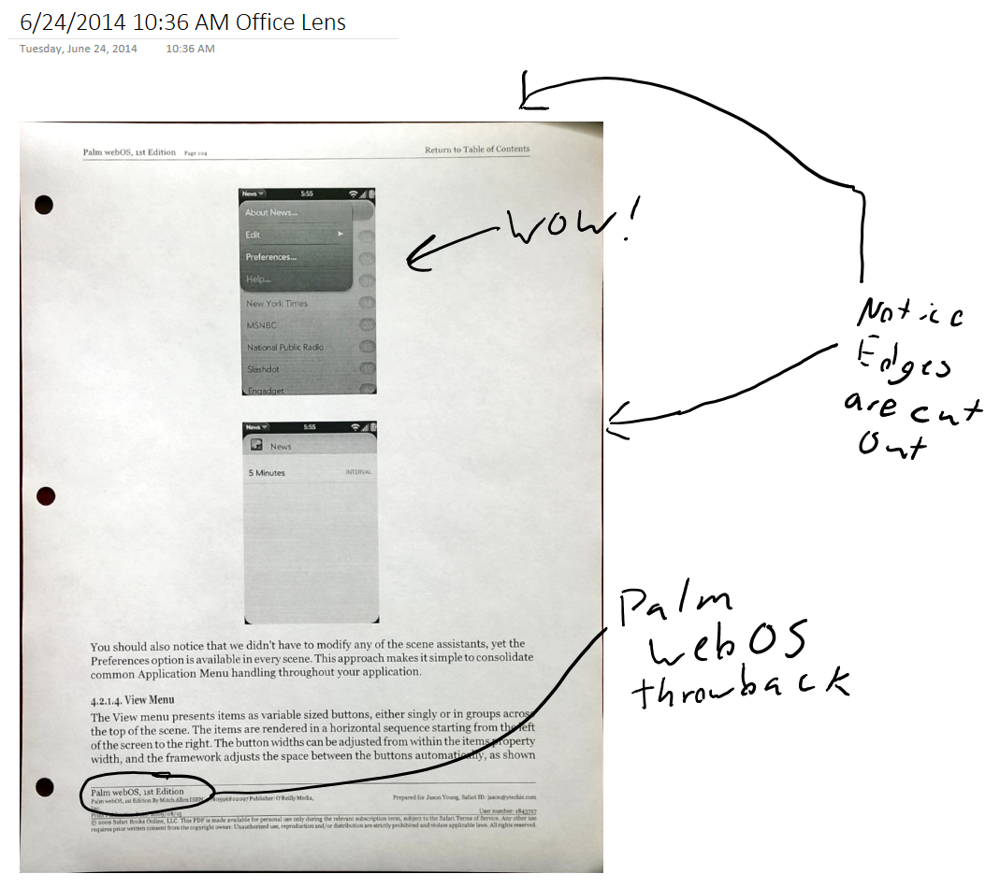
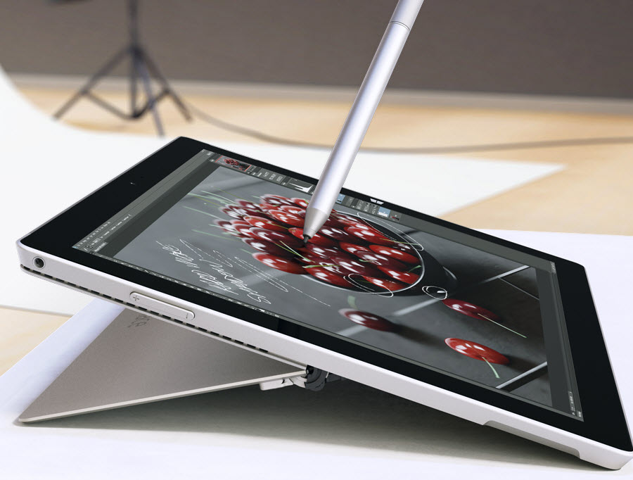
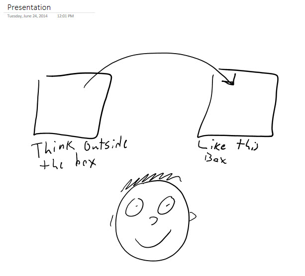
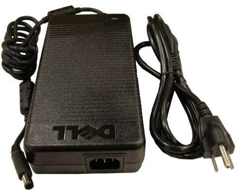

I've been using a Surface Pro 3 for a few days now (borrowing it from my wife until I get my own). I wanted to show some of the scenarios that the kickstand, the pen, and the form factor provide. I do work at Microsoft, but I'm free to use any type of device I wish, and I don't work for the Surface team.

The Surface Pro 3 is often a misunderstood device, and let's face it, it's a difficult product to explain and market. The way I see it is that at the low end of $799, it's a replacement for the high-end iPad market. The midrange models are extremely capable laptop and tablet killers, and the high-end models can handle pretty much anything.

### 1. Scan and Annotate

The Surface Pro is an amazing note-taking device and it opens up some new scenarios that may not be immediately obvious.

Let's say we have an interesting document in our hands, and we want to mark it up. We may be able to use a standard pen to write on the document itself, but there are times when we can't write on it, or we simply want to go paperless. The [Office Lens app](http://blogs.office.com/2014/03/17/office-lens-a-onenote-scanner-for-your-pocket/) turns your phone into a scanner in your pocket. For example, you can scan in a sheet of paper or a whiteboard, and it will do edge detection, and it will also try to remove the background when possible.

Using my phone and the Office Lens app, I scanned in a sheet of paper and hit save, which sent it to OneNote. Within seconds, the scan was available in OneNote on my Surface. I was then able to use my pen to annotate the document.

Alternatively, you can use the camera built into the Surface itself.

### 2. Use on-screen keyboard in reclined position

Thanks to the new kickstand design, you can position the Surface Pro 3 to be slightly angled (nearly flat). This is useful when drawing, but I have found that it also provides the best angle for typing. I've seen people that were able to type on a tablet laying flat, but I found that to be very difficult without tacticle feedback.

*Magic floating pen?*

I often remove the keyboard and walk around with the Surface to use it as a consumption device. While you won't find the on-screen keyboard a replacement for a physical keyboard, it can certainly work in a pinch thanks to the new angles.

### 3. Use the Pen as a Whiteboard in a Presentation

Personally, my goal is to minimize the dreaded "death by PowerPoint", and instead focus on code and content. Using a typical whiteboard is often far to small for the audience to see.

The Surface Pro 3 makes a great developer presentation device, and the presenter can switch over to an application like OneNote and write or draw something. Used properly, it can create a more engaging experience.

### 4. Keeping your Lap Cool

In a traditional laptop, all of the heat generating components are in the base, or the part that sits on your lap. The result is usually just discomfort in the summer, but in severe cases it can cause [skin damage or even reduced fertility](http://www.emaxhealth.com/1506/laptop-users-warned-burn-risk).

With the Surface Pro, the parts that touch your body are the kickstand, the bottom edge of the device, and the keyboard. All of these components should be room temperature since they don't create any heat. The heat is allowed to vent vertically, far away from your skin.

### 5. Gaming

The iPad is great for casual gaming. However, there are 2 large shortcomings. First, the iPad does not have an accurate pointing device. There are capactive pens available, but they don't have anywhere near the same level of accuracy. The Surface pen has sub-millimeter accuracy.  Second, the iPad can't run some of the amazing legacy games like one of my all-time favorites, Age of Empires II.

This game is actually pretty amazing on the Surface. The high resolution screen shows you a good portion of the map and the pen works great for picking single units or grouping multiple units.

### 6. Extreme Portability

The Surface can replace your laptop and your tablet, but I think that's only part of the story. The Surface power adapter is extremely light. Laptops often have a dirty little secret, which is that they have a huge, heavy power brick.

Just take a look at this beast!

I can't find a consistent weight measurement for the Dell M6400 power adapter, but I'm guessing it weighs more than the Surface Pro 3 with a type cover and power adapter. I should also mention that the MacBook Air power supply is very light, and Apple did a great job paying attention to that detail.

Personally, I would love to have a requirement for laptops that they must include the weight of their power supply in the specifications if the device doesn't last an entire day with normal usage. After all, the power supply is something you're likely to need to carry along with you.

The point is that that the Surface Pro 3 is ridiculously light. It's 1.76lbs, the cover is [10 ounces](http://www.microsoftstore.com/store/msusa/en_US/pdp/Surface-Pro-Type-Cover/productID.300193600), and the power supply is [6 ounces](http://www.microsoftstore.com/store/msusa/en_US/pdp/Surface-Pro-3-Power-Supply/productID.300191700). The total weight for everything in your bag is 2.78 lbs. It's light enough that the weight of the bag you put it in starts to become a factor.

It's also light enough that you're far more likely to take it with you. Much like the best camera is the one that you have with you, the best computer is the one you have with you.

When you start to consider this is a device that can help you go paperless and can possibly even be your reading device, you realize that you can shed a lot of the load.

### 7. Detach the Keyboard

The detachable keyboard is one of the fundamental selling points of the Surface Pro 3, yet the commercials did a terrible job showing how powerful this feature is.

I fly occasionally, and due to motion sickness, I usually use the time to catch up on movies. I originally used my Surface 2, but it was an extra device I had to put in my bag in addition to my laptop. Then, I switched to my Nokia Lumia 1520, which has a MicroSD slot, which let me fit 30+ movies on it. This works pretty well, but holding the phone is a bit of a hassle. When I do decide to get some work done, I can't hold the phone and use a laptop at the same time.

With the Surface Pro 3, I can leave it in my bag for the security check. Once on the plane, I can hold it during takeoff, and during the flight I can use the kickstand to sit it on the tray table. The combination of the screen, kickstand, and MicroSD slot, make it the best airplane device for me. If I want to get some work done, I move the movie off to the side, and run visual studio in the rest of the screen. The high-res screen gives me plenty of code real-estate.

### Conclusion

I love this device. Its flexibility is exactly what I'm looking for.