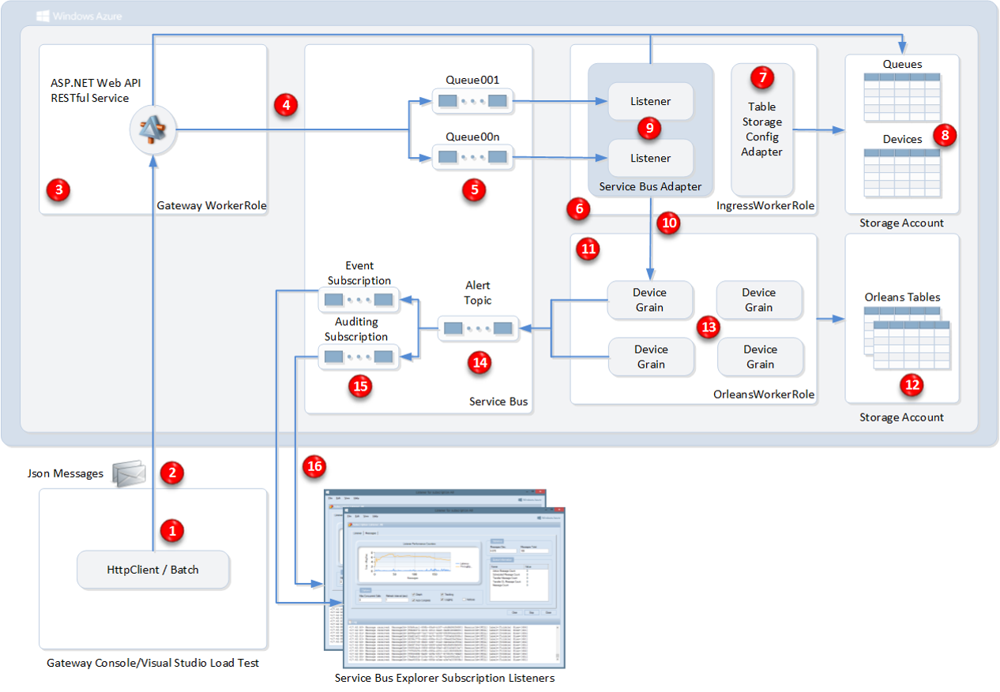
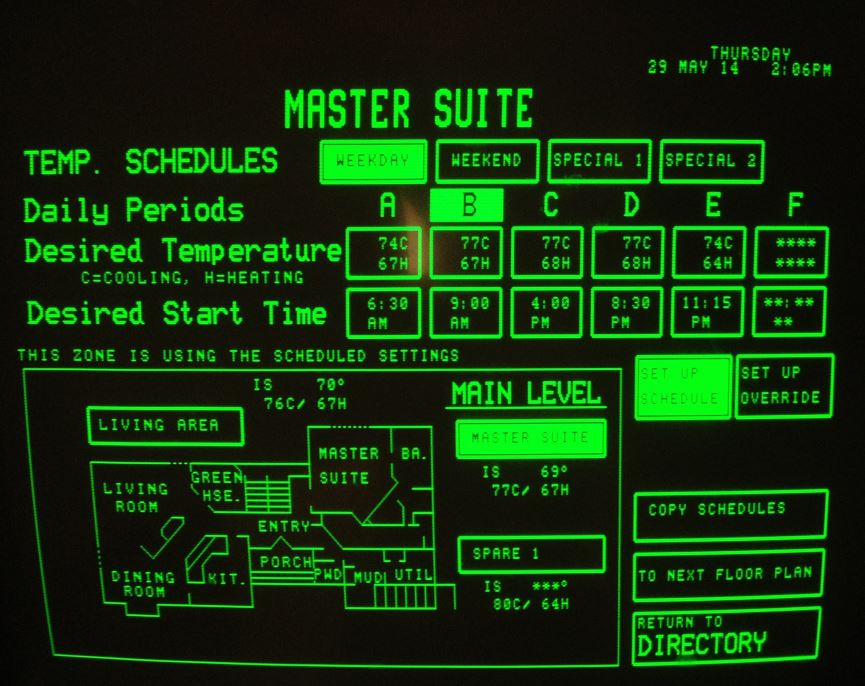
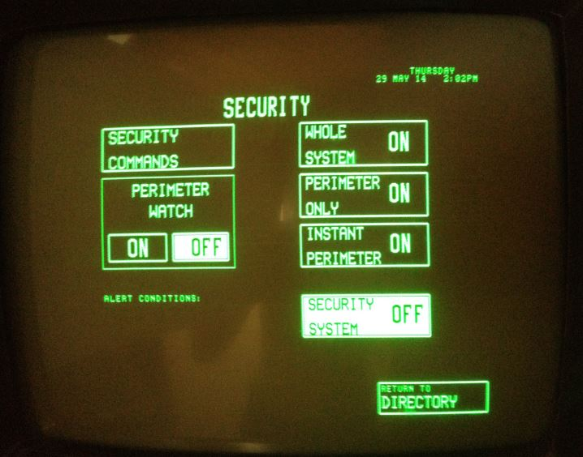
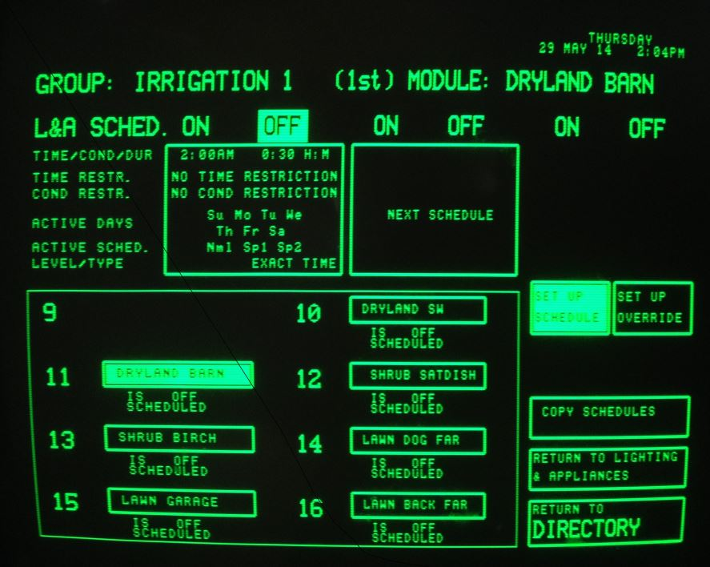

IoT.

Internet of Things.

The trillion dollar question is "what is it?". I've heard answers ranging from "a way for your refrigerator to push data to your phone" to "anything data related".

I just attended the [Internet of Things World Conference](http://iotworldevent.com/). The attendees and companies were as diverse as the answer to that question. Chip vendors, cloud providers, IoT branded companies, sensor providers, integrators, and product vendors.

The mere existence of the event and companies branded as *Internet of Things* represents the growing mindshare and buzzworthiness. A clever name may be all that is required to get companies to rally around it. Don't take that statement too lightly. I really think the branding is important here. We've seen it before, "the cloud", "AJAX". All of these are technologies that were not new when the term was created, but the mere existence of a term pushes it forward.

### So what is it?

What is IoT to me? I focus primarily on manufacturing. The majority of my career has been spent creating software that powers manufacturing. In the context of manufacturing, IoT represents a new economic proposition for sensors, control hardware, and data processing. Sensors are getting cheap enough to measure, and later analyze the data later to create interesting models. We finally have Internet connections that can push much of this data to a central repository. To process the data, we now have proven elastic cloud platforms that can scale down to a small shop, or up to the largest companies in the world.

Manufacturing seems ripe for the picking. Lots of potential for data collection and lots of low hanging fruit in terms of analysis and ROI.

This doesn't come without a unique set of challenges. From a hardware standpoint, the environment is a nightmare. We need to contend with dust, humidity, temperature extremes, vibration, and a reflective wireless environment.

Manufacturing tends to move very slowly. At the end of the day, they have product to produce. [Modbus](http://en.wikipedia.org/wiki/Modbus), the de facto standard for industrial communications, was developed in the 70's. It's reliability and interoperability has been time proven. For an IoT solution to be successful, it must be able to augment, not replace these existing solutions. Now, throw in multiple layers of networking, only 1 of which has direct internet access, and that internet access is likely slower than what you have at home.

Once we jump through all of these hoops to get data out of the facility, now we have to operate at cloud scale. The platform must be secure, scalable, and reliable. At Microsoft, there are a lot of efforts to make these processes as easy as possible.

Be sure to [watch the presentation](http://channel9.msdn.com/Events/Build/2014/3-635) by the Azure Service Bus team where they talk about how they're ingesting data at scale.

You're going to hear myself and others talk about data until we're blue in the face. Meaningful, actionable data is what we get out of all of this. Once we can centralize the data, we can do things like cross-facility benchmarking, predictive analysis to keep less parts on hand, actionable enterprise-wide data. Historical data is nice to have, real-time information is great, and accurate predictive data is game changing.

You won't hear me talk often about IoT security. The reason being that it must be present throughout the entire system. As a user of the technology, I don't want to think about security, but I want it to be pervasive and invisible.

### What about Residential?

I have a lot of people ask me about how IoT fits into the residential space. As a person who has a mile of Cat 6 in his house, and a wireless network with over 20 devices including 3 thermostats, I want IoT to be ubiquitous more than anybody. Unfortunately, there are a lot of great niche products on the market today, but nobody has a good "system". If someone does, I don't see it.

Why doesn't my security camera help the Nest know when I'm home? Why don't my lights turn on when I walk into the bathroom? Why can't I choose "scenes" from a wall mounted panel or my phone? Why can't I see a comprehensive environmental map of my house? Why doesn't my house know when pollen levels are high so I can take my allergy medication? The truth is that most of this was possible in **1985**.

This automation has a **touchscreen** to control the entire system.

*Temperature Control*

*Security*

*Irrigation Control*

*HVAC Control*

**This should be blowing your mind right now.** This was nearly 30 years ago, and this house did much of what we think we want today. Time of day controls, security, HVAC, even irrigation, all in a relatively intuitive interface.

Want to build a system like that today? Head over to [SmartHome.com](http://www.smarthome.com/) and you'll find everything you need.

The problem is that most people are waiting to see who is going to win the battle for the home. It could be Apple, Microsoft, Google, or it could be anyone else. The thought of any one company with exclusive control should be terrifying.

*OK, so maybe customers aren't looking for features, maybe we can motivate them with money? For example, running their washing machine during off-peak hours*

I've spoken to residential energy providers, and the message is always the same. For consumers, the decision making process is more emotional than logical. I remember when fluorescent light bulbs were free or close to free thanks to energy rebates. Even at the price level near $0, it wasn't enough motivation for many people to switch and they instead chose the default of *inaction*. The same goes for old refrigerators, dehumidifiers, and water softeners. Investing in a new fridge will often pay for itself, but the owners keep the old one and lose money in installments.

> The best thing about standards is that there are so many to choose from.

The only way we'll get over the current hump is to start seeing a clear pattern of interoperability. Consumers and businesses alike need to feel like they're making a long-term **investment**. Paying money to solve a single problem may work in certain niche cases, but will never realize the full potential of this market.

This is only the beginning.

**[Brent Stineman, a colleague and friend, has a follow-up/response that you should check out here](http://brentdacodemonkey.wordpress.com/2014/06/19/attempting-to-define-iot/)**

### Relevant Links I find Interesting

* [Ingesting data at scale with Azure](http://channel9.msdn.com/Events/Build/2014/3-635)
* [Clemens Vasters talking about IoT scenarios and how we're solving real problems](http://www.dotnetrocks.com/default.aspx?showNum=990)
* [Satya Nadella](http://online.wsj.com/article/PR-CO-20140415-911273.html) talks about ambient intelligence