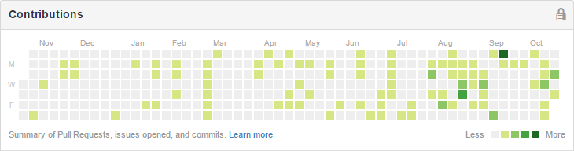

How many times have you run into a problem with your code? Stuck so bad you can't think about anything else. As time goes on, you get more desperate, changing your search terms, Looking for any glimmer of hope. You reach a point of desperation where you'll cut and paste any code you can find in the hopes that you'll get closer to the answer.

Conversely, how many times have you created a new console app to create a quick and dirty proof of concept? If it worked, where did you put that code?

I've been thinking about writing this for some time. Over the past few months, I've gotten in the habit of publishing every proof of concept, every sample project, and every demo. It feels great. I even [started a podcast](http://msdevshow.com/) just to have more public discussions.

I know what you're thinking - it takes too much time and I have work to do. It takes much less time than you think, and the ROI will make it worthwhile. Get out there, [create your GitHub account](https://github.com/).

When you create a GitHub project, all you really need is a name, but ideally it should also have a readme file. I used to think this was a hassle, but I've come to realize that it's actually worth the time investment. When you have to explain a piece of code to someone else, it forces to you think just enough to ensure that it makes sense. For my quick and dirty test project, this may be just a single sentence. If it's throwaway code, just be honest and mention that.

Your code doesn't need to be perfect, and if you are afraid of public criticism, get over it. You need to focus on the developers that are desperately looking for a fix to their problem.

Scott Hanselman had a similar thought [on his blog recently](http://www.hanselman.com/blog/PutYourselfOutThereAndPublishThatOpenSourceProjectToday.aspx):

> I hear several times a week things like "I'm not ready for people to see my code." But let me tell you, while it may be painful, it will make you better

Since using GitHub for my sample projects, I've found some other significant benefits:

* **Easy to email & share** - When a coworker asks how to solve a problem I've already solved, I'm able to look at my GitHub account, even if I'm on my phone. I can grab a URL of the relevant file, and email a link. 
* **Free backup** - Over the years, as I've switched computers, I've lost a lot of code I wish I had saved. Putting it on GitHub, ensures that I can access it at any point in the future without having to worry about keeping backups.
* **Work from multiple computers** - I've found it extremely helpful to create a proof of concept on one machine, and then pull it down to another as reference.

**Stop making excuses. Contribute back to the community.**