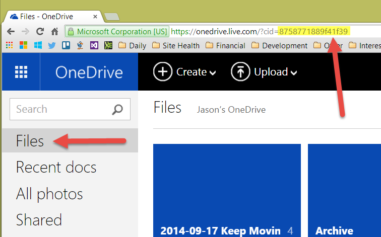
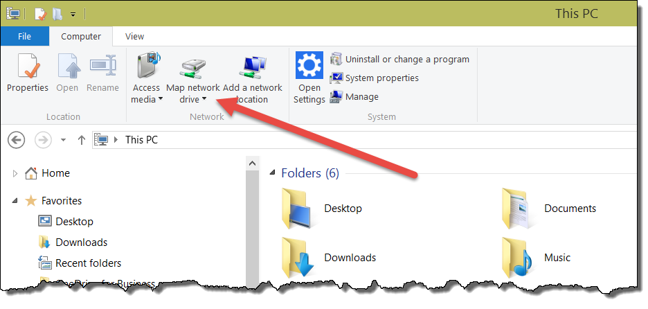
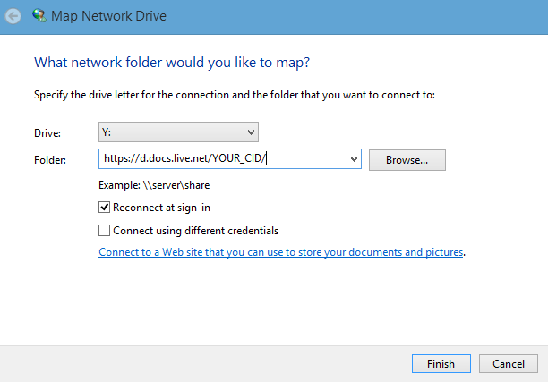
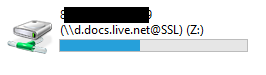
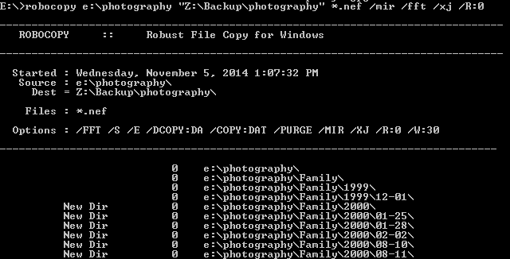

Recently, Microsoft announced they're increasing OneDrive from 1 Terabyte, to unlimited. Unlimited as in infinity, endless, never ending, vast. You get the point. The only catch is that you have to have an Office 365 account. Considering you can get one for [as little as $69.99/year](http://products.office.com/en-us/buy/office), this is a phenomenal deal even if you don't use Office. If you get the 5 user edition for $99.99, you'll get unlimited space for everyone in your household. That's like 5 infinities! Kids know that the more infinities you have, the better.

The killer feature for OneDrive is that the files you store in it *don't have to actually take up any space on your hard drive*. After a file sits unused for some time, it can switch to an online-only mode. It will still appear to be on your computer, but it takes up zero space. For example, my OneDrive folder has 100+ GB on it, but on my laptop, it only takes up 307 MB on disk. When I try to open a file that's not actually on this computer, it will automatically pull the file down and make it available offline. It's all transparent to the user. This is a big improvement over the [selective sync option in Dropbox](https://www.dropbox.com/help/175).

Now for the bad news. On my desktop, I have a 9 TB storage array, and a 512 GB SSD. My photo collection has ballooned in size, and is now well over 200 GB. If I were to simply copy these files into my OneDrive, I would both fill up my SSD, and the files would ultimately end up online-only. I want to have quick (read: local) access to all these files.

My first thought was to use robocopy, a powerful file copy utility included with Windows. My hope was that I could maintain a backup copy in my OneDrive, and simply mirror the new photos as they were added. I tried every combination of command line parameters, but I always ran into errors from robocopy (file cannot be accessed by the system) because it wasn't designed to work with files that only *appear* to exist.

Then, a breakthrough. I learned that OneDrive supports WebDAV. WebDAV is a protocol that runs on HTTP and allows you to open a remote resource as a folder in Explorer. It let's you do tricks like open a SharePoint document collection in an Explorer window.

## Mounting OneDrive as a Folder

First, you'll need a special ID, called a `cid` to make this work. It's easy to get, just go to [OneDrive.com](http://onedrive.com), and click *Files*. In the URL, grab the `cid` value after the equals sign.

Next, open an explorer window, navigate to your computer ("This PC"), and click "map network drive" in the ribbon.

The drive you're mapping is **https://d.docs.live.net/YOUR_CID/**, be sure to enter your CID in that URL.

When prompted for a username/password, use your live ID for the username. For the password, you can use your live password if you don't have 2-factor authentication enabled. If you DO have 2-factor authentication, [generate an app password here](https://account.live.com/proofs/AppPassword?mkt=en-us).

Congratulations, you now have OneDrive mapped as a drive on our computer. This is different than the typical OneDrive folder, because changes on this drive are reflected immediately in the cloud.

## Robocopy

Now that we have a drive that takes up no space on our computer, but allows us to copy files to it without affecting our local copy, our work is easy.

For my photos folder, I run the following command line script:

	Robocopy e:\photography "z:\backup\photography" /mir /fft /xj /R:0

Here is an explanation of the parameters I'm using:

* **e:\photography** - The *source* of the files I would like to backup.
* **z:\backup\photography** - The *destination* of the backup in OneDrive.
* **/mir** - Mirror all of the changes from the source in the destination. This will delete files that have been removed in the source. You may choose to skip this so that accidental deletes won't propagate.
* **/fft** - This uses a time comparison method that can vary by a few seconds. I found this works better since the times in the source and destination won't be exact.
* **/xj** - Excludes junction points, which are normally included by default. This may not be necessary.
* **/R:0** - Don't retry if there is an issue. We'll just try again in our next backup.

## Performance

Performance of WebDAV is not that great to be honest. Navigating around the drive is an exercise in frustration, but it wasn't designed to be used that way.

Performance of copying the files is alright. I've let it run overnight and it copied up a few gigs. After the initial load, the speed won't be an issue. But truthfully, I don't need it to be fast. It's just an additional backup.

## Summary

Everyone repeat after me. **OneDrive is NOT a backup solution**. That being said, it can be part of a balanced backup diet.

You should always have an additional off-site backup, more are better. I rotate external drives for this purpose.