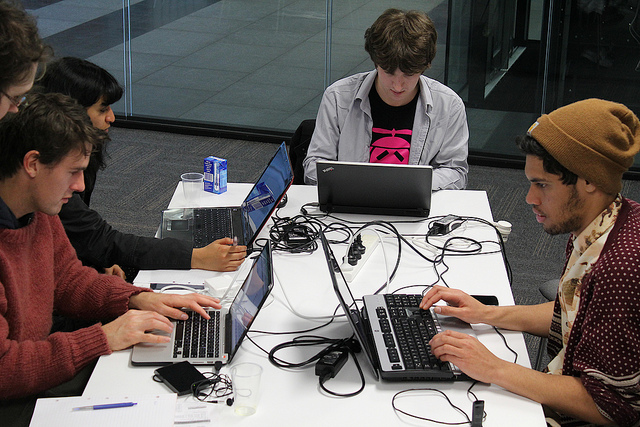
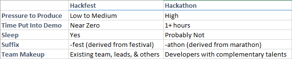

Software development is moving at an insane rate. Keeping up with a single technology area keeps getting more difficult. Just look at web technology. Grunt, Gulp, Yeoman, Angular, Bower... verb.js. How do we balance the need to be agile and continuously produce, with the productivity increases we get with new technology? There is a definite possibility that the latest library/framework/technique can change the way you write, built, or deliver code. You could understand it today, or allow your competition to understand it first.

I've seen a simple practice that can change how your organization researches new technologies or explores new concepts.

It's as simple as this:

**Get a group of your developers together, throw out all of the rules, and just create something new.**

That's it. That's all it takes, and I'm here to tell you firsthand that it absolutely works.

It sounds simple, but it's one of the most powerful tools you can use. Set aside a block of time like a week or a weekend, come up with a goal, and just work together to see what you can build. The space will be a mess of cords and the discussions will be crazy, but it's all part of the process. It's like a startup where the results are more important than process.

###Hackfest vs Hackathon

I often see the term Hackfest and Hackathon used interchangeably. While the loose definitions overlap, I think there is some value in making a distinction.

> Hackathons are intense and exhausting, and they’re meant to be. They’re usually a whole weekend of focused work, often with insufficient sleep, and too much encouragement to use masses of caffeine to stay awake and coding for 48 hours.
>
> Sorry, but I’m not going to do that for my projects, let alone yours.
> 
> -[Alex Bayley](http://infotrope.net/2014/11/28/why-i-dont-like-hackathons-by-alex-bayley-aged-39-12/)

Hack**athons** is a combination of hack and marathon. Hackathons I've seen are typically competitions, which makes them much different than a hack**fest**.

###Include Everyone

Feel free to include everyone. This might be a good time for testers to provide feedback early on in a new process. Managers can learn a lot at these events, and they often were full-time programmers at one point. I've found they get the most excited about getting a chance to get their hands dirty and create something again.

The best part of including everyone is that you can learn from each other. A group of attendees with a diverse set of backgrounds is ideal. Hacking with JavaScript developers made me go out an use Angular.js on a project. A IoT hackfest got me interested in using devices for collecting sensor data with Azure. Hacking alongside a Technical Fellow gave me a vision of the future. I have a vivid memory of all of these experiences.

###We're too formal for a "hackfest"

The second I say *hackfest*, I'll occasionally get the person that starts rolling their eyes. Interestingly enough, if I call it an *application accelerator*, it starts to sound like a great idea. Call it whatever makes sense for your company and project. It's the concept that is most important.

###Why they Work

Hackfests work amazingly well for a number of reasons:

* There is little to no stress to produce anything. This could lead to something amazing, or fail miserably. Failing still means we've learned something important. I've never seen a person leave without having learned something significant.
* The environment is different. Just developing in a different context can change the emotional state of the developer.
* There are no irrelevant interruptions. A good hackfest will provide isolation from the steady stream of calls, emails, and other distractions that force everyone to switch contexts.
* If nothing else, consider this a team building exercise.

The best part is that this doesn't have to be an isolated event. Run a hackfest, see if it works, and then try to replicate the success. The more regular you make your hackfests, the easier they become. The overhead of planning meals, hardware, and instructions become minimal.

###Don't Stop Now!

If you run a successful hackfest, don't stop there! Schedule the next one. Keep the rhythm of innovation going. The amount of overhead at each one will decrease, and the value will increase.

Don't forget to share the results with everyone up your org chart. Showing that this is a powerful tool will give you buy-in for the next hackfests.

###Related
[7 Lessons from Running a Hackathon](http://www.ytechie.com/2014/01/7-lessons-running-a-hackathon/)

###Credits
[Summer of Tech 2013 Hackfest Image](http://www.flickr.com/photos/4nitsirk/9631734969/) is Creative Commons