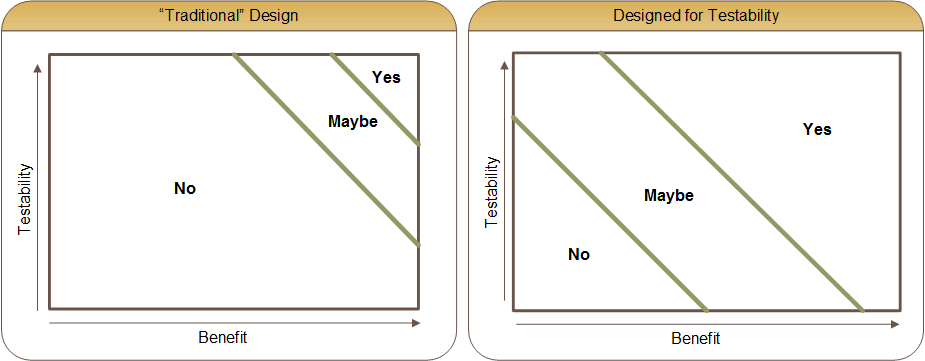

*This is a segment that I wrote for a book used internally and with Microsoft partners.*

Building a car may seem like a complicated process (because it is), but imagine if the design of the car changed on a daily basis. Also imagine if the tools and processes changed daily. With few things being constant, creating a quality automobile would become increasingly difficult. Welcome to the world of software engineering. The factory is your favorite editor, the cars are your code, and the customer is everyone.

The reality is that all developers test their code. How many times have you made a change, compiled the code, waited for the application to run, and then navigated through the application to execute the code you just wrote? The problem is that efficiency goes down dramatically the longer you have to wait to see a result from the changes you make. Looking back at the car example, would you rather buy a car whose quality was checked in every step during construction, or would it be acceptable if the testing was done only once the car was assembled? Considering the higher potential for significant re-work and the associated schedule impact when testing is deferred to the end, which approach do you think will prove faster?

Avoiding bugs is much more enjoyable than having to fix bugs. Features such as type systems exist to join the “result” of the code with the creation of the code. Defining a variable to be a particular type is actually a specification or test definition that runs at compile time against all usages of that variable. Languages like TypeScript allow us to use the full power of a dynamic language like JavaScript, with the safety of a type system.

Since software development is highly dynamic, there is no single way to build applications, but we can increase code and app quality by following proven principles. For example, the SOLID principles published by Robert C. Martin provide some fundamental tenants.

SOLID is actually an acronym of 5 other acronyms, defined below. With good design principles comes testability. Testing is a word that typically strikes fear into the hearts of developers. Like many fears, understanding removes the fear. In fact, a good unit test should be simple, useful, and actually saves development time. Using that definition, it’s not possible to have a unit test that will “cost” you time. 

Instead they provide you with immediate value.

<table>
	<tr>
		<td>SRP</td>
		<td>The Single Responsibility Principle</td>
		<td>A class should have one, and only one, reason to change.</td>
	</tr>
	<tr>
		<td>OCP</td>
		<td>The Open Closed Principle</td>
		<td>You should be able to extend a class’s behavior, without modifying it.</td>
	</tr>
	<tr>
		<td>LSP</td>
		<td>The Liskov Substitution Principle</td>
		<td>Derived classes must be substitutable for their base classes.</td>
	</tr>
	<tr>
		<td>ISP</td>
		<td>The Interface Segregation Principle</td>
		<td>Make fine grained interfaces that are client specific.</td>
	</tr>
	<tr>
		<td>DIP</td>
		<td>The Dependency Inversion Principle</td>
		<td>A class should have one, and only one, reason to change.</td>
	</tr>
	<tr>
		<td>SRP</td>
		<td>The Single Responsibility Principle</td>
		<td>Depend on abstractions, not on concretions.</td>
	</tr>
</table>

(source: [Agile Principles, Patterns, and Practices in C# by Robert C. Martin](http://www.amazon.com/Agile-Principles-Patterns-Practices-C/dp/0131857258/?tag=ytechie-200))

The figure below illustrates this difference. Code not designed for testability will be, well, largely untestable. This is what typically deters developers from making testing part of their development process. As we learn how to craft our code into well designed components, the amount of code that is easily tested will be the majority. There will be some additional code that has a questionable return on testing investment, and code that will never make sense to test. The Y-Axis is the degree of testability, or the ease of which a particular piece of logic can be tested. The X-Axis is defined as “benefit,” which is comprised of how often the code will be reused, the importance of the code, the complexity of the code, and the risk level associated with the code not working as expected.

