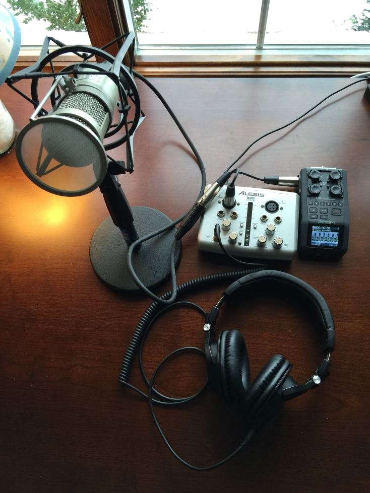
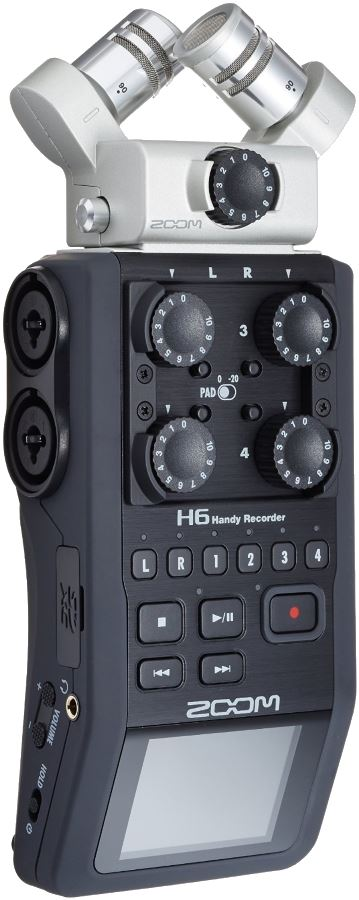
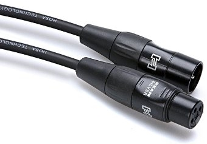
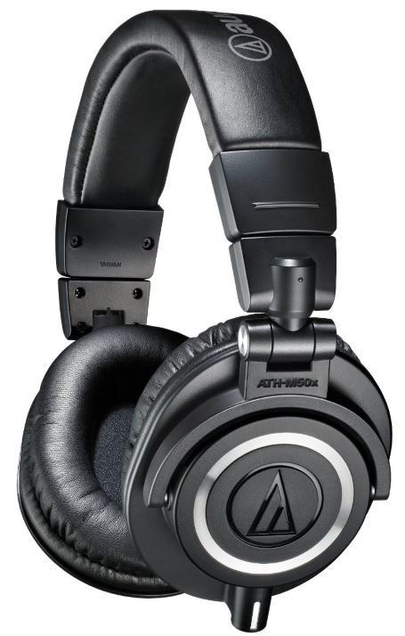
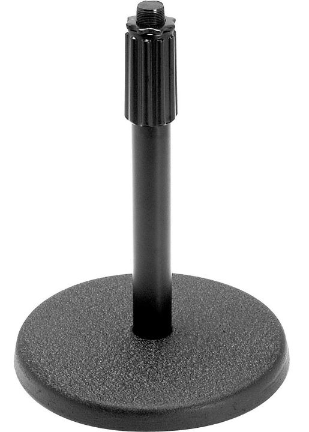
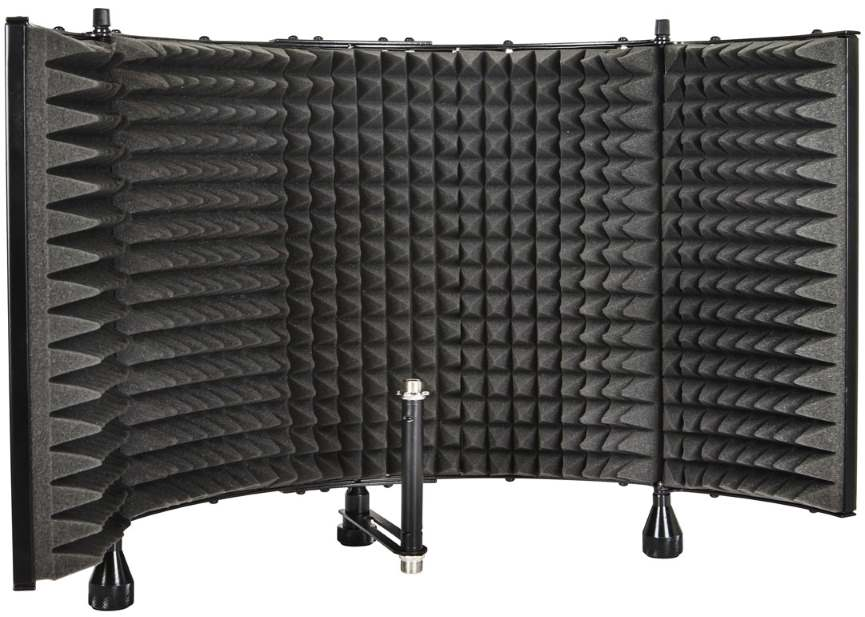
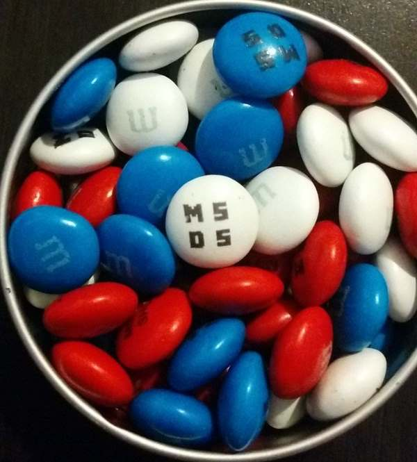

This is an update to my earlier post [How We Produce the MS Dev Show Podcast](http://www.ytechie.com/2015/01/how-we-produce-the-msdevshow-podcast/). Carl and I have focused on streamlining the process to minimize the amount of time we need to dedicate on each episode. That means we have more time to spend with guests and content (and day job).

This is the setup Carl and I each have for a typical podcast:

## Bye Compressor/Gate/Limiter

We previously had a compressor/gate/limiter wired in to our audio chain. What I've found is that there is nothing you can do in real-time during recording that you can't do in post editing. In fact, during editing, there is more information available. The [Auphonic Multitrack Processor](https://auphonic.com/multitrack) does a phenomenal job selecting the right track at the right moment, and determining the perfect level. It also does an amazing job at removing noise. For Carl and I with our good mics, the noise is minimal. For guests, sometimes we deal with a lot of noise. Auphonic reduces the noise as much as possible, and attenuates their track when they're not speaking.  

Due to our dependence and quantity of usage of Auphonic, we switched from their online service to their desktop application. This means that we spend less time transferring files back and forth with the cloud, and we don't have to worry about per-episode costs.

## Hardware Recorders

We originally bought a [Zoom H6 Six-Track portable recorder](http://www.amazon.com/gp/product/B00DFU9BRK?ref=ytechie-20) for a conference, but we were just blown away by the capabilities. We ended up buying a second as a spare. We also started using our hardware recorders as a backup for our audio tracks. By using a simple [XLR splitter](http://www.amazon.com/gp/product/B000068O59?ref=ytechie-20), we're able to use the recorders as dedicated audio backup devices. Even if Carl or I have a computer issue while recording the show, the hardware recorder ensures we have a reliable raw track to fall back on.

Our mics run into the XLR splitter, and then go directly into the hardware recorder as well as our USB interface. This simple design minimizes any single points of failure.

The recorder also functions as a mixer, and when we do shows at a conference, it's easy for us to adjust gains while recording.

## Better Cables

We found out the hard way that our cables sucked. Interestingly, price doesn't seem to correlate with quality. We had a cable with a bad end that would cause occasional static.

TIP: If you have a bad cable, cut it and throw it away! It's not worth keeping!

We've had good luck with [Hosa XLR cables](http://www.amazon.com/gp/product/B004TVJL1U?ref=ytechie-20). The ends are top quality, and the connections have been great.

## Headphones

A good pair of headphones will allow you to hear a complete range of sound without artificially changing it. Not only do they sound great for music, but they also give you an unbiased representation of what you're recording. During the editing process, they're invaluable in hearing every detail.

I picked up the [Audio Technica ATH-m50x headphones](http://www.amazon.com/Audio-Technica-ATH-M50x-Professional-Monitor-Headphones/dp/B00HVLUR86?ref=ytechie-20). They come with interchangeable cables. For podcasting, I use the coiled cable with a 1/4" connector. The cable extends long enough that I can go up to a few feet away from the USB interface if needed.

## Basic Stands

I thought having a big boom arm for my mic was a necessity, but again, simpler turns out to be the better option. I switched over to a [basic mic stand](http://www.amazon.com/gp/product/B0002M3OVI?ref=ytechie-20) that I can just move into place on my desk. As an added bonus, it's over $100 less expensive.

## Isolation Shield

I have a [sound isolation shield](http://www.monoprice.com/Product?p_id=602650) that I put on my desk behind the microphone which helps reduce echo from my walls and monitor.

## Guest Gifts

Our amazing guests are one of our best assets. We wanted a way to show our appreciation. Starting in 2016, we'll be providing a care package to guests. We're still working on the details, but our current plan is to include the following:

* A thank you letter
* MS Dev Show M&Ms
* An MS Dev Show mousepad
* An MS Dev Show Moleskine notebook

## What's Next?

<blockquote class="twitter-tweet" lang="en">
<a href="https://twitter.com/ytechie">@ytechie</a> At this point, I think you&#39;re going to have to give the barking dog cohost credits.
&mdash; Michael Szul (@szul) <a href="https://twitter.com/szul/status/676934719301402624">December 16, 2015</a></blockquote>

One thing we're looking at is an easy way to wire in an XLR mute box. Basically, we want to have a button we can push to temporarily mute ourselves if our kids or pets are loud. We're still working on figuring out the best option here.

## Summary

I believe the absolute key to keeping a podcast going is making it as little work as possible. This allows you to focus on content.

**Automate.**

**Keep it simple.**

**Enjoy.**
