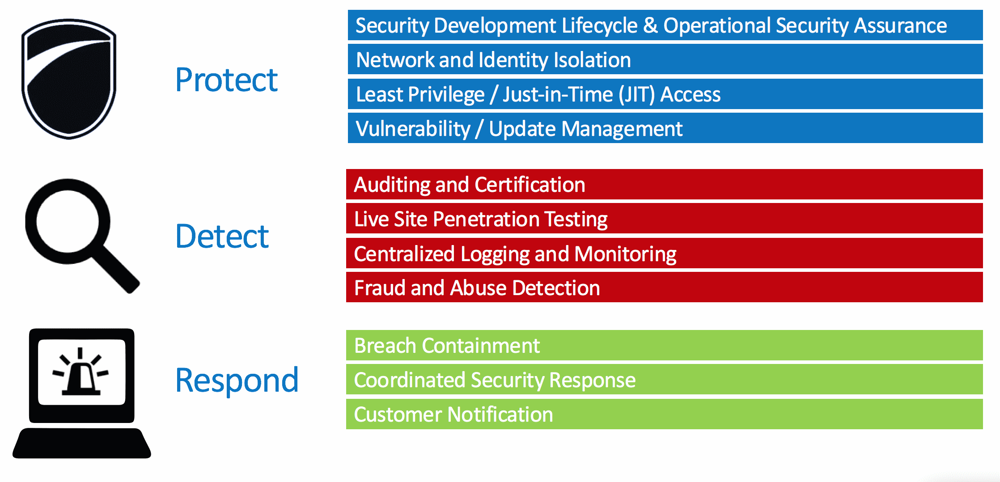

IoT, or the Internet of Things, is going through a transformation. There is a shift from having to build your own IoT stack to having a market of IoT platform providers. We’ll see a parallel to the cloud where the first phase was everyone calling themselves "cloud", and eventually the market converged on a small number of trusted platforms. There will be a point at which it is no longer viable to build and IoT solution from the ground up, and in fact, we may have already passed that point. It far easier to bring an IoT product to market by building on an existing platform.

This blog post will cover the top 3 categories of considerations that are the foundation of choosing an IoT platform provider. 
 
### Security
 
Much like the early days of computer hardware and software proliferation, many IoT devices are rushed to market. These companies that "bolt-on" security before shipping have presented challenges for anyone embracing IoT. As IoT is integrated into every type of device, security poses a monumental risk.

Fortunately, there is already a mature PC market that has taught us how to build security not only into products, but into the entire development process.

 
Security must be a fundamental principle throughout the entire software development and product lifecycle. Smaller companies generally don't have the resources, experience, and historical codebase necessary to roll their own. They're left with the choice to either ship a risky product or build upon another platform from a company with a proven security track record. Much as many organizations have experienced enhanced security as they’ve shifted to cloud computing, many products will have improved security and lifecycle management when using a mature, secure IoT platform.

For a great presentation on IoT security, I recommend checking out a presentation Clemens Vasters gave at //Build/ 2015: https://channel9.msdn.com/Events/Build/2015/2-625
 
### ROI
 
The next consideration is return on investment. It's simply an equation of value to the business minus the cost. Different IoT technologies and vendors will focus on different industries and scenarios. For example, one company may focus on supporting industrial automation scenarios, another may focus on automating homes, and yet another may focus on automation at a municipality level.
 
The cost of these various options may vary dramatically. One service might charge per device per month, while another may charge for data transfer and storage. The cost to implement as well as the ongoing costs need to be considered. Long-term projections will need to take into account the potential lifespan of a device. Additionally, implementation costs should factor in tooling costs such as licensing and software support. 
 
### Maturity

Gartner summarizes providers based on completeness of vision and ability to execute. These are great high level indicators of a mature platform. Let’s break maturity down further.

Security and ROI should be the minimum bar for consideration when choosing an IoT platform. The next differentiator is maturity, and has many critical aspects. Recently, Nest shut down Revolv, and while the number of users was relatively small, the news sent shockwaves through the IoT industry. A technology that they adopted and trusted was pulled out from under them.
 
What type of support is offered? Having support throughout development planning, development, and production is critical. During development, documentation itself is rarely sufficient. Guidance, including hands-on technical sessions from an experienced platform vendor goes a long way. In production, good support is key to assessing, responding to, and minimizing an outage.
 
Has the industry accepted the technology? In other words, has the platform survived scrutiny? A long-lived service that has stood the test of time is likely to be battle hardened. Ideally, an inference about the long-term viability of the platform is clear.
 
What are the performance characteristics? End-to-end performance must meet the requirements of your customer. This performance is a combination of time for edge processing, latency to the platform, latency within the platform, and latency within additional code. Generally speaking, the system has to be tested as a whole. The platform vendor should have real examples of production applications along with tested end-to-end latency statistics.
 
What features can be leveraged? A mature product will have a relatively complete feature set. There should not be obvious gaps. How well does the feature set align with the goals of your project?
 
Is the technology interoperable? IoT at its core is designed to connect devices and gain insights and capabilities from those relationships. Therefore, it’s key for an IoT platform to work with external systems without unneeded friction. Mature IoT platforms will recognize this, and while there will be advantages of using their full stack, they should be compatible with other popular technologies. This will also be evident through strategic partnerships made by the provider.

A platform provider must have experience in your domain. Whether it’s monitoring of remote oil wells, or controlling the temperature of your house, the platform provider must understand your business. The provider should be well known for experience in the problem domain.