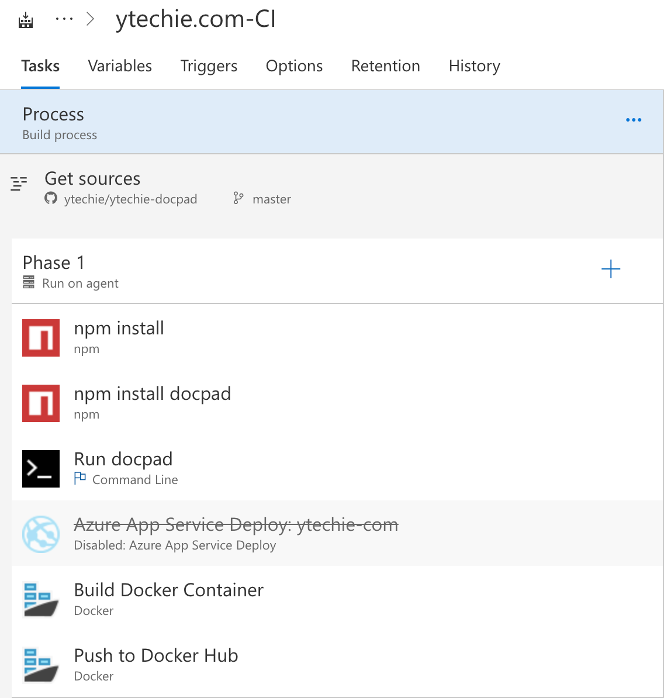
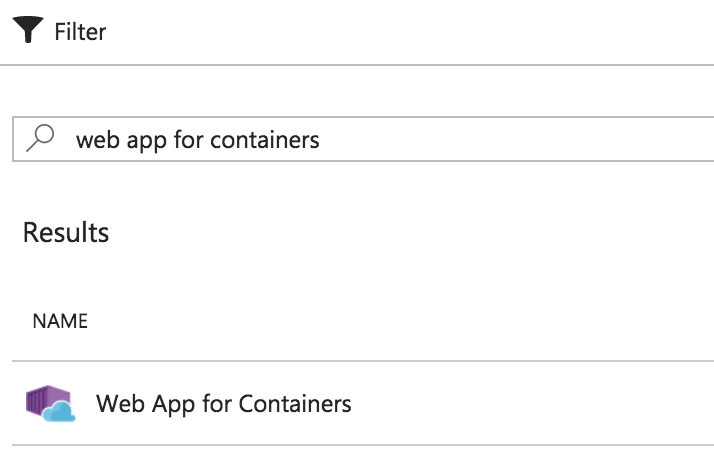
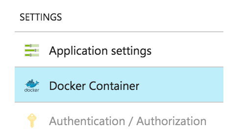
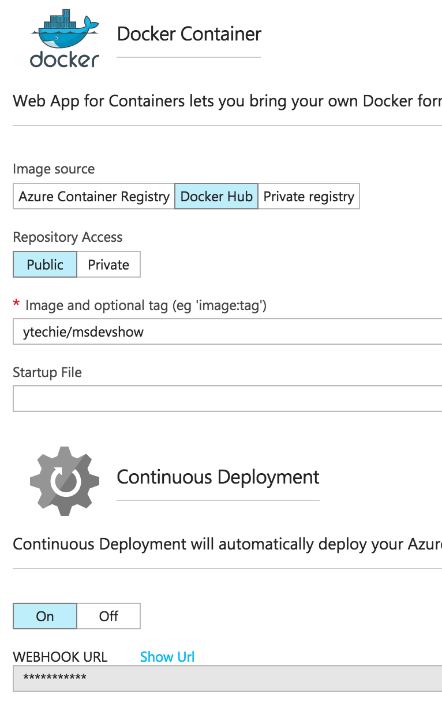

I've been trying to learn more about Docker by finding more opportunities to use it. To that end, I decided to move my blog into a container and host it with the Azure Linux Web App service, which natively supports Docker.

While it may seem like a pointless exercise, it **resulted in a much more natural build and deployment pipeline**, which I will describe in more detail.

This site itself is [completely static](http://www.ytechie.com/2013/11/blogging-awesomeness-with-a-static-generator-and-markdown/), and is generated from markdown files at build time. That means it can easily be hosted by virtually any webserver. I chose [nginx](https://www.nginx.com/) due to its speed, pervasiveness, and because I just wanted a chance to try it out. :-)

Note: One _critical_ requirement is that when I check in a file to GitHub, I want it to automatically build and deploy to production.

## Creating the Dockerfile

I started by creating a simple Dockerfile, which is the definition for how my site will get packaged up into a container image.

My initial version was this simple - use the nginx image as a starting point, add my HTML files, and expose the server over port 80:

    FROM nginx
    COPY ./out /usr/share/nginx/html
    EXPOSE 80

See how simple Docker can be?

This also allows me to test the entire site locally. In fact, if you have docker installed and want to try running my site locally, simply run:

`docker run -i -d -P ytechie/ytechie-docpad`

Then run `docker ps` to get the local port number and browse to that!

## Update my build process

I use VSTS to build my website, and it's complely free.

Originally, I had the build configured to push directly to Azure once the build was finished. In hindsight, **it was very inelegant do have the build process also push the deployment.**

I disabled the old push step, and added 2 new docker steps:

The first Docker step actually builds the image from the Dockerfile.

The second docker step pushes that image to [DockerHub](https://hub.docker.com/r/ytechie/ytechie-docpad/).

Note: I did get stuck at one point trying to get the paths to work properly. Some people actually use a separate Dockerfile for their build system, but I really wanted to avoid that. In the end, I updated my docpad build step to output to `$(Build.Repository.LocalPath)/out`. Specifically, I used this commandline in the docpad step:

`generate --env static --out $(Build.Repository.LocalPath)/out`

## Azure Linux Web Apps

Next, I created the Azure Linx Web App. After using `+ Create a Resource` in the Azure portal, search for `web app for containers`.

After you have set up the site, scroll down to `Docker Container`:

Then you'll see where you can specify the Docker container image to deploy. In my case, the image is coming from Docker Hub.

At the bottom of the settings pane, be sure to turn on "Continuous Deployment" and copy the Webhook URL. You'll need to supply Docker Hub with that URL so that when the image is updated, your site will update automatically.

Note: Since Azure separates the app service **plan** from the actual **site**, you can pack as many web sites as you want into a given server. In my case, I pay for 1 Linux instance, and deploy all my websites/images to it for the **same price**.

## Using a custom nginx.conf (optional!)

Once I got the basic site up and running, I needed to make a view changes to how nginx is configured.

To do this, I had to first modify my Dockerfile to remove the default nginx configuration, and copy in my local configuration. I added these lines to my Dockerfile:

    RUN rm /etc/nginx/conf.d/default.conf

    COPY ./out /usr/share/nginx/html
    COPY nginx.conf /etc/nginx

You can see my current Dockerfile [here](https://github.com/ytechie/ytechie-docpad/blob/master/Dockerfile).

In my `nginx.conf`, I customized it for another one of my sites to force removing www. and ensuring https is used:

    # if www, redirect to non-www
    server {
        listen 80;
        server_name www.msdevshow.com;
        return 301 https://msdevshow.com$request_uri;
    }

    server {
        listen 80;
        server_name localhost;

        error_page 404 /404.html;
        root /usr/share/nginx/html;
    }

    server {
        listen 80 default_server;
        server_name _;

        #force SSL
        if ($http_x_arr_ssl = "") {
        return 301 https://$host$request_uri;
        }

        error_page 404 /404.html;
        root /usr/share/nginx/html;
    }

If you want to see the complete nginx.conf for the MS Dev Show, you can [view it here](https://github.com/ytechie/msdevshow/blob/master/nginx.conf).

## Summary

As soon as I finish writing this post, I'll commit my changes to GitHub. VSTS will immediately pick up those changes, and begin building. After ~3 minutes of building the Docker image, it will push that to Dockerhub, and the Azure Linux Web App will pull and deploy that image in about 30 seconds.