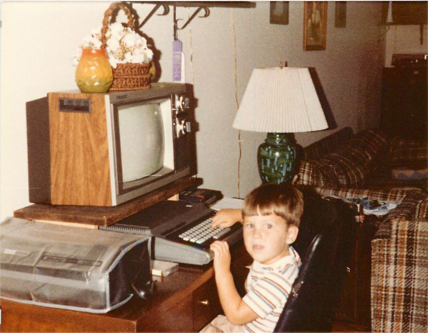

I'm Jason Young, husband, father, passionate engineer, architect, and [Time Person of the Year in 2006](http://en.wikipedia.org/wiki/You_(Time_Person_of_the_Year)).

Here is where it all started. A [TRS-80 Color Computer](http://en.wikipedia.org/wiki/TRS-80_Color_Computer) from Radio Shack. My parents couldn't afford the floppy drive, so we used [cassette tape storage](http://en.wikipedia.org/wiki/Commodore_Datasette).

Here is me a few years later after buying my [Macintosh Plus](http://en.wikipedia.org/wiki/Macintosh_Plus) from my dad for $200. He originally paid $5000. 

The Mac Plus was a glorious machine with a 512×342 monochrome screen (for comparison, OSX icons are higher resolution), 1 MB of RAM, and used 800 KB floppy disks, and had no hard drive. Nonetheless, it was a powerful productivity machine. It could run games way ahead of its time, and it could even play video and sound. If you want to try running one, there is actually a [complete emulator that runs in JavaScript](http://jamesfriend.com.au/pce-js/).

For bonus points, find the following in the photo:

* PC World magazine
* Romulan Warbird
* Remote Control Car
* Micro cassette tapes
* Remote controlled car

Professionally, I started working with ASP.NET while 1.0 was still in beta. Since then, I've written software at companies like [GE](http://www.ge.com/), [Skyline Technologies](http://www.skylinetechnologies.com/), [Orion Energy Systems](http://www.oesx.com/), and [Microsoft](http://www.microsoft.com/). My brain is written in C#, I speak Node.js, and I believe the universe runs on Windows Azure.

I feel amazingly fortunate to be on the same team as many [amazingly smart developers](http://www.zdnet.com/microsoft-builds-a-deep-tech-team-to-attract-next-gen-developers-7000015270/) out there helping [people write amazing software](http://www.citeworld.com/development/22690/microsoft-developer-strategy-revamp).

**This blog is my own, and represents my opinions, and not those of my employer.**

You can subscribe to this blog via [RSS](http://www.ytechie.com/rss), and you can also find me on:

* [Twitter](http://www.twitter.com/ytechie)
* [LinkedIn](http://www.linkedin.com/in/jasony/)
* [GitHub](https://github.com/ytechie)
* [Stack Overflow](http://stackoverflow.com/users/23837/jason-young)

