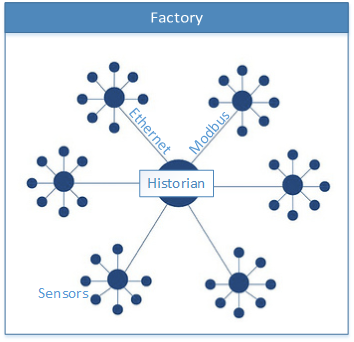

I've been spending a lot of time recently thinking and literally dreaming about IoT (Internet of Things) applications. I wanted to share some of my current thinking on where we're at, what is happening, and what things might look like in the future.

### Manufacturing Data Today (the boring part)

Within a manufacturing plant today, we can categorize the software into 3 high-level layers, which are not necessarily easy to delineate:

* [ERP: Enterprise Resource Planning](http://en.wikipedia.org/wiki/Enterprise_resource_planning)
* [MES: Manufacturing Execution System](http://en.wikipedia.org/wiki/Manufacturing_execution_system)
* [SCADA: Supervisory Control & Data Acquisition](http://en.wikipedia.org/wiki/SCADA)

These systems are all extremely complex, and I'll never fully understand them. I'm more concerned with the raw plant sensor data, how it flows, and how we turn that into meaningful information.

Optical sensors, pressure sensors, temperature sensors, and any other sensor you can imagine probably already exists and is in use within Manufacturing today. Manufacturing generates far more data than any other vertical. I suspect manufacturing has been one of the key drivers behind the dropping prices of sensors over the past few decades.

The communication network within your typical plant is based on standards that were defined over 4 decades ago. These networks exist to multiplex and centralize all of the data in the plant. Of course you'll find siloed subsystems that work independently, and aggregate data is sent to the central location. You'll find pockets of newer TCP/IP networks, but you'll also find a lot of low-speed serial communications.

At the center of this system is a high-performance, time series database, known as a [Historian](http://en.wikipedia.org/wiki/Operational_historian). This is the center of the universe. All data is stored here. Security is handled through virtue of being only internally accessible.

For corporate-wide reporting, data needs to be aggregated from this historian, either through additional software, or through the ERP system and processes. This tends to be expensive, difficult, and incomplete due to the delta between the vast amount of data collected from the source, and the aggregated enterprise data.

### The IoT / Cloud Transition (the fun part)

We have all of this data at the source, great. Now what? The real power is in **unlocking the data**.

There is some very low hanging fruit that is driving change today. Thanks to falling storage and compute costs in cloud environments, there is a big incentive to centralizing our data. Having all of our data aggregated in the cloud means that we can run massive, scalable jobs and generate reports at a scale that used to be difficult and costly. We can not only start to benchmark multiple facilities, we can drill down to any level. Slicing and dicing the data moves from being the job of a report writer, to that of the report viewer.

Machine learning is the new frontier, and has far reaching implications. Previously, we had to know exactly what questions to ask, and having enough compute power to explore the data was expensive. Today, the cloud provides the massive horsepower we need to not just explore the data quickly, but to also glean insights that we never thought of.

Throughout history, we've spent a significant amount of time analyzing data, looking for reasons why and when things fail, trying to predict order volumes, trying to figure out how to maximize employee productivity, and the list goes on. These are questions that can be explored, and potentially optimized by data scientists and machine learning. Machine learning as a service makes it a commodity, available to any sized business, on-demand.

### The Future (the exciting part)

I hope that once the dust settles, we'll have standards that allow devices from various companies to inter-operate in a reliable, secure manner. 

Plummeting device costs are a given, so it's safe to assume we'll have more computing power available to us almost universally. To really get value from the data, we first need to allow devices to share it. If device A knows what device B is up to, Device A can operate more intelligently. This is a collective intelligence. This collective intelligence will also require a management hierarchy. A management hierarchy allows higher levels to have a greater understanding of *what* should be accomplished, and less about *how* it should be accomplished.

Does this sound familiar? This is how employees are traditionally organized within an organization. As you go up the management chain, the goals become more focused on the overall organizational goals. As you go down the management chain, you get to where the real work happens, and there may be far less context in the larger organization.

Organizations are starting to evolve into a more networked design, and so will *devices*. Devices will have a roughly hierarchical organization, but will realize advantages to direct communications. Features like high availability can exist at lower levels.

Now, we want to get data from any point in the hierarchy to where it is needed. A machine operator needs to know what is happening in the machine in real-time. The supervisor needs to know how multiple lines are operating in real-time. The plant manager needs to know how the overall plant is running, again, in real-time. We'll also need to store historical data, operational reporting data, and so on.

### Further Reading

* [Top 10 Benefits of IoT in Manufacturing](file:///C:/Users/Jason/Downloads/Create_the_Internet_of_Your_Things_Top_10_Benefits_manufacturing%20(1).pdf)
* [Reference Architecture Framework for Discrete Manufacturing](http://www.microsoft.com/enterprise/industry/manufacturing-and-resources/discrete-manufacturing/reference-architecture/default.aspx#fbid=kwzcHNa8OHZ)
* [Building Smarter Manufacturing With The Internet of Things](http://www.cisco.com/web/solutions/trends/iot/iot_in_manufacturing_january.pdf)