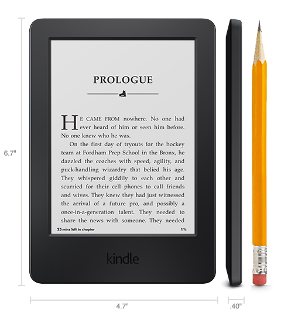
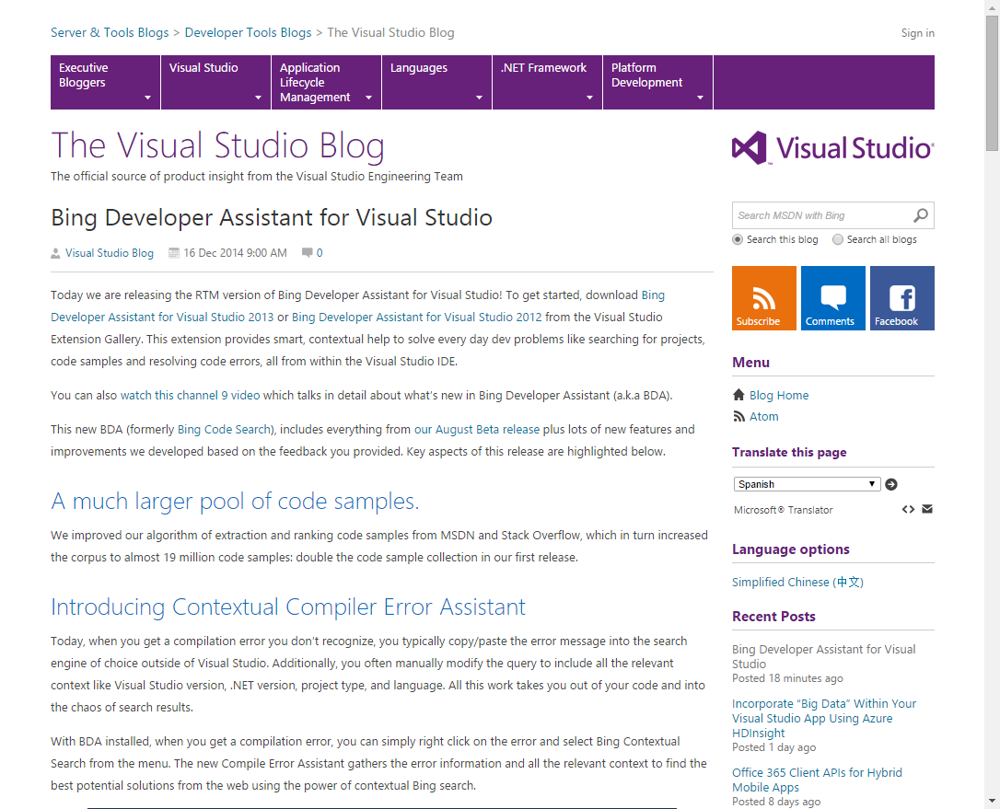
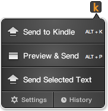
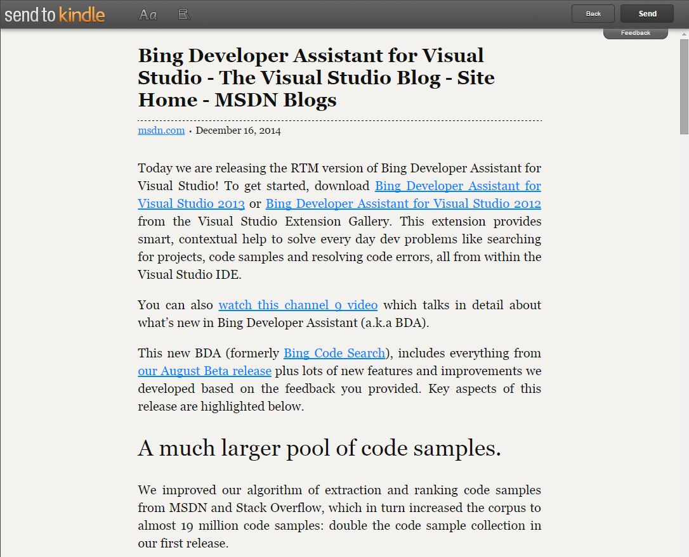

I *finally* bought a Kindle. For me, the cost of a Kindle has been too high for a device that I wasn't sure I would even use. This last black Friday, I saw a deal that allowed me to get a Kindle for $35. Sold!

I don't read many books, but I love to read long-form news articles. I already spend too much time at my computer, and reading them on my phone is usually an exercise in frustration.

What's different about these "reader" devices? **eInk**. Instead of trying to blast light at your eyes, they simply change the way light is reflected to your eyes, just like paper.

> This may make them more comfortable to read, and provide a wider viewing angle than most light-emitting displays. The contrast ratio in electronic displays available as of 2008 approaches newspaper, and newly developed displays are slightly better. An ideal e-paper display can be read in direct sunlight without the image appearing to fade.
>
>http://en.wikipedia.org/wiki/Electronic_paper

Anyway, let's get to the point.

### How do we get great content on to it?

The first way is by far the simplest. Amazon actually provides a [Chrome/Firefox browser extension](http://www.amazon.com/gp/sendtokindle/chrome/) that let's you quickly take the article you're currently looking at, format it, and send it to the device in seconds.

Let's take this MSDN post:

Press a button:

and get this preview (we can skip this step):

This is great, and it's pretty easy, but it's a manual process. I use this to queue up longish articles I find online, and when I find myself with some downtime away from the computer, I catch up with my reading.

### Automating

I was looking for a way to **automatically** send new RSS items to my Kindle. I saw people like [Scott Hanselman using Instapaper](http://www.hanselman.com/blog/InstapaperDeliveredToYourKindleChangesHowYouConsumeWebContentPlusIFTTTBlogsAndMore.aspx) or other services, but I'm not particularly happy with any of them. Some of them are broken, [some don't accept new members](http://kindlefeeder.com/), and [some are just too much manual work](http://kindle4rss.com/). 

Each Kindle gets a unique email address that can have content emailed to it, so it was just a question of how to get new RSS items, and email them to the device in a timely matter.

### JavaScript (Node.js specifically) to the rescue!

What are the key pieces?

* A config file to store the RSS feed list, as well as any other keys and settings
* A way to read RSS feeds
* A way to convert the RSS content to a format Amazon can work with
* A way to email the Kindle email address
* A way to persist information about what has already been sent.
* A way to run in the cloud

Let's go through these one by one.

#### Config File

JavaScript makes JSON config files soooo easy. (I like using JSON configs in my .NET projects as well, so [I created a library for that](https://github.com/ytechie/ConventionConfig))

	function loadConfig() {
		var deferral = Q.defer();
	
		console.log('Loading configuration...');
		fs.readFile('config.json', function (err, data) {
		  if (err) deferral.reject(err);
		  console.log('Config Loaded: ');
		  
		  var config = JSON.parse(data);
		  console.log(config);
		  deferral.resolve(config);
		});
	
		return deferral.promise;
	}

#### Reading RSS Feeds

In Node.js, there is a module for anything and everything. Reading a feed is easy with the [Feedparser](https://github.com/danmactough/node-feedparser) library. It makes it easy to read a feed and iterate the metadata and body from the posts.
	
	var FeedParser = require('feedparser')
	  , request = require('request');
	
	var req = request('http://somefeedurl.xml')
	  , feedparser = new FeedParser([options]);
	
	req.on('error', function (error) {
	  // handle any request errors
	});
	req.on('response', function (res) {
	  var stream = this;
	
	  if (res.statusCode != 200) return this.emit('error', new Error('Bad status code'));
	
	  stream.pipe(feedparser);
	});
	
	
	feedparser.on('error', function(error) {
	  // always handle errors
	});
	feedparser.on('readable', function() {
	  // This is where the action is!
	  var stream = this
	    , meta = this.meta // **NOTE** the "meta" is always available in the context of the feedparser instance
	    , item;
	
	  while (item = stream.read()) {
	    console.log(item);
	  }
	});

#### Converting HTML to Kindle

This one was tricky.

TODO!!!!!

#### Emailing

[SendGrid](https://sendgrid.com/) is my go to service for sending emails from a cloud application. The best part is that with a free Azure account, you get a SendGrid account that allows you to send 25,000 email messages each month for free. Plenty for this application. You can use SendGrid via SMTP, or via an API. They even provide code for various languages to make it easy to integrate.

Here is how easy it is from Node.js:

	// using SendGrid's Node.js Library - https://github.com/sendgrid/sendgrid-nodejs
	var sendgrid = require("sendgrid")(api_user, api_key);
	var email = new sendgrid.Email();
	
	email.addTo("test@sendgrid.com");
	email.setFrom("you@youremail.com");
	email.setSubject("Sending with SendGrid is Fun");
	email.setHtml("and easy to do anywhere, even with Node.js");
	
	sendgrid.send(email);

#### Persistence

Initially, I used a basic JSON file as a cache. That allowed me to take my JavaScript object structure containing the last emailed PubDate's.

Then, I kicked it up a notch and integrated in DocumentDB, a hosted JSON document store. They provide a great Node.js interface, and even a variant that uses promises. Sweet!

Once we initialize our database, we can read the cache like this:

	function loadCache() {
	    var deferred = Q.defer();
	
	    console.log('Loading DocDB database...');
	
	    client.queryDocuments(cacheCollection._self, 'select * from root').toArrayAsync()
	        .then(function (results) {
	        if (results.feed.length === 0) {
	            deferred.resolve({ feeds: {} });
	        } else {
	            var cache = results.feed[0];
	            for (var key in cache.feeds) {
	                cache.feeds[key].lastPubDateSent = new Date(cache.feeds[key].lastPubDateSent);
	            }
	            deferred.resolve(cache);
	        }
	    });
	
	
		return deferred.promise;
	}

[(You can view all of my DocumentDB code here)](https://github.com/ytechie/kindle-rss/blob/master/docDb.js)

#### To the Cloud!

TODO!!!!!