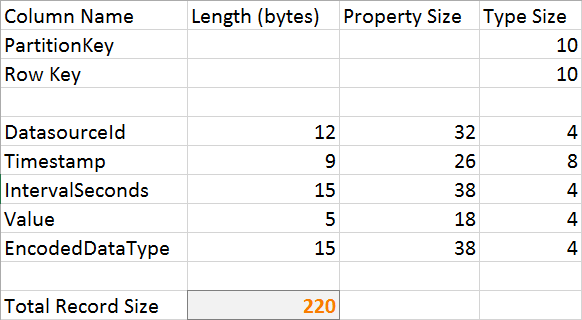

### The Data

	CREATE TABLE [dbo].[Raw](
		  [Id] [int] IDENTITY(1,1) NOT NULL,
		  [DatasourceId] [int] NOT NULL,
		  [Timestamp] [datetime] NOT NULL,
		  [IntervalSeconds] [int] NOT NULL,
		  [Value] [varbinary](max) NOT NULL,
		  [EncodedDataType] [int] NOT NULL,
		CONSTRAINT [PrimaryKey] PRIMARY KEY CLUSTERED
		(
			[Id] ASC
		)
	)

### Size & Cost

Here is the query to determine space taken by our tables:

	select sys.objects.name, sum(reserved_page_count) * 8.0 / 1024
	from sys.dm_db_partition_stats, sys.objects
	where sys.dm_db_partition_stats.object_id = sys.objects.object_id
	group by sys.objects.name

#### Table storage

I found [a formula for calculating the side of an entity](http://blogs.msdn.com/b/avkashchauhan/archive/2011/11/30/how-the-size-of-an-entity-is-caclulated-in-windows-azure-table-storage.aspx
) in Azure Table Storage.

Pros:

* Extreme performance scaling thanks to cloud-scale partitioning
* Scales to extreme levels

Cons:

* Inefficient retrieval protocol
* No secondary indexes
*

#### Blob Storage
