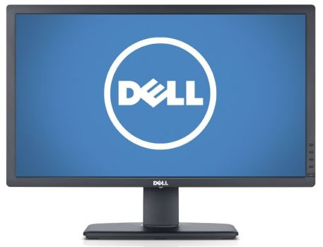
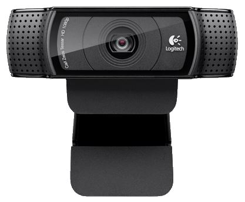
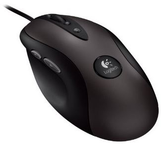
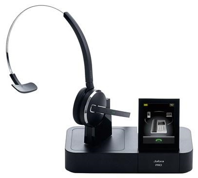
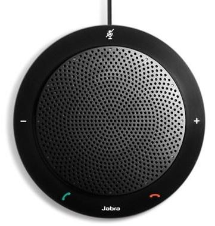
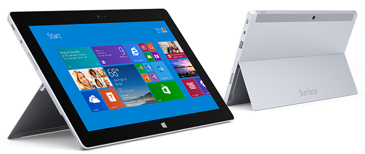
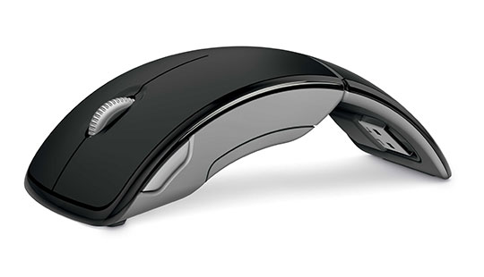
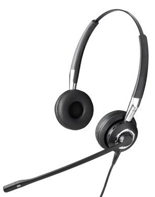

I put a lot of time into trying out various computer hardware, and I often get questions about what I use at home and when traveling. I consider every item on the list below to be the best option in their class when considering performance, usage, and price. Of course your requirements may vary.

##### [Dell u2713hm](http://www.amazon.com/Dell-U2713HM-IPS-LED-CVN85-27-Inch-LED-lit/dp/B009H0XQQY?tag=ytechie-20) 

Pixels are king. More pixels mean more code and less window management. The Dell u2713hm is 2560x1440 with IPS goodness for amazing viewing angles. It actually took me some time to get used to the sheer real-estate available on these monitors. Even major productivity tools like Outlook easily fit docked to half of one of these. It can be a bit pricey, but monitors tend to be a multi-year investment that outlasts the rest of your computer.

#### [Logitech C920 Webcam](http://www.amazon.com/Logitech-Webcam-Widescreen-Calling-Recording/dp/B006JH8T3S?tag=ytechie-20)

Working from home means I'm on a lot of video calls. The best webcam I've used, hands down, is the Logitech C920. Full 1080P with hardware encoding and dual-nose canceling microphones.

#### [Logitech G400 Mouse](http://www.amazon.com/Logitech-Optical-Gaming-High-Precision-910-002277/dp/B0055QZ216?tag=ytechie-20)

Nothing exotic here. I tend to stick with mice that track well, and feel well in my hand. No extra bells or whistles.

#### [Jabra 9470](http://www.amazon.com/Jabra-Wireless-Touchscreen-Deskphone-Softphone/dp/B002LARYAG?tag=ytechie-20)

If you're on the phone a lot, a good headset allows you talk move around without getting tangled up in wires. This headset is extremely comfortable, and the range is so good it even works outside my house. It makes you sound loud and clear, and makes it easy to hear without disturbing others. This particular headset works great with VOIP (Lync/Skype), but it can also be used for wired phones, and even has Bluetooth support for cell phones.

#### [Jabra Speak 410 Speakerphone](http://www.amazon.com/Jabra-Speak-410-Speakerphone-Lync/dp/B004ELA7TA)

I rarely use a speakerphone, but this one is the best. The quality, features, and sound are much better than the Plantronics version for the same price.

#### [Surface 2](http://www.microsoft.com/surface/en-us/products/surface-2)

For some of my shorter trips, I'm able to pack light and take my Surface 2. Along with the Windows store apps, I get full Outlook, Word, Excel, and PowerPoint. If I need a full computer, I'm able to use the remote desktop client to access my [home computer](http://www.ytechie.com/2013/03/my-ivy-bridge-i7-build/). The battery easily lasts all day.

#### [Microsoft Arc Mouse](http://www.amazon.com/Microsoft-ZJA-00001-Arc-Mouse-Black/dp/B001C4ETU0?tag=ytechie-20)

When I'm traveling, a good mouse is key to being productive. Touch and a trackpad only get you so far. This is the old version of the Arc mouse. I tried the [new version](http://www.amazon.com/Microsoft-Arc-Touch-Mouse-Black/dp/B003UT6C9G?tag=ytechie-20) and I couldn't get used to the lack of a scroll wheel.

#### [Jabra Biz 2400](http://www.amazon.com/Jabra-Optimized-Corded-Headset-Softphone/dp/B0028RD02I?tag=ytechie-20)

This headset folds up fairly small and doesn't add much weight to my bag. It works for Lync and Skype on both my laptop and Surface. It also has convenient controls in the cord such as volume, mute, and end call.

